# MinLish Developer Wiki & Onboarding Guide

Chào mừng bạn đến với tài liệu kỹ thuật dành cho nhà phát triển của dự án **MinLish** - ứng dụng học tiếng Anh thông minh. Tài liệu này được thiết kế để giúp bạn nhanh chóng hiểu rõ cấu trúc dự án, luồng nghiệp vụ và cách đóng góp code hiệu quả nhất.

---

## 1. Hướng dẫn dành cho Kỹ sư trưởng (Principal-Level Guide)

### Triết lý thiết kế cốt lõi (Architecture Blueprint)
MinLish được xây dựng dựa trên nguyên lý **Clean Architecture** kết hợp với mô hình **MVVM (Model-View-ViewModel)** và giao diện khai báo **Jetpack Compose**. Toàn bộ mã nguồn được thiết kế xoay quanh nguyên tắc **SOLID**, đặc biệt là **Dependency Inversion Principle (DIP)** và **Open-Closed Principle (OCP)**.

Ứng dụng tách biệt tuyệt đối giữa các tầng:
1. **Presentation Layer (Compose UIs, ViewModels)**: Nhận tương tác từ người dùng và quan sát (observe) luồng State từ ViewModel.
2. **Domain Layer (UseCases, Domain Models, Repository Interfaces)**: Chứa toàn bộ nghiệp vụ thuần túy của ứng dụng, hoàn toàn độc lập với các thư viện bên thứ ba (Android SDK, Firebase, Network...).
3. **Data Layer (Repository Impl, Data Sources, Network APIs, Database)**: Triển khai chi tiết cách lấy và lưu trữ dữ liệu (Firestore, Local Preferences).

#### So sánh Tư duy: Kotlin Clean Architecture vs Python Simple Layered
Để hiểu rõ sự khác biệt của Clean Architecture (đòi hỏi tính trừu tượng hóa cao) so với cách viết thông thường, hãy xem so sánh dưới đây:

* **Tư duy thông thường (Python - Gọi trực tiếp):**
```python
# Gọi trực tiếp API và lưu DB từ Controller/UI
def lookup_word_simple(word: str):
    import requests
    response = requests.get(f"https://api.dictionary.com/{word}")
    data = response.json()
    save_to_db(data)
    return data
```

* **Tư duy Clean Architecture (Trừu tượng hóa & Đảo ngược phụ thuộc):**
```python
# 1. Domain Layer: Định nghĩa Interface (Không phụ thuộc vào bất kỳ thư viện nào)
class LookupStrategy(ABC):
    @abstractmethod
    def lookup(self, word: str) -> Result[VocabularyWord]:
        pass

# 2. Domain Layer: Use Case sử dụng Interface
class LookupWordUseCase:
    def __init__(self, strategy: LookupStrategy):
        self._strategy = strategy
        
    def execute(self, word: str) -> Result[VocabularyWord]:
        return self._strategy.lookup(word)

# 3. Data Layer: Triển khai chi tiết Interface (Sử dụng API thực tế)
class GeminiLookupStrategy(LookupStrategy):
    def lookup(self, word: str) -> Result[VocabularyWord]:
        # Tích hợp Gemini AI API thực tế ở đây
        ...
```

### Sơ đồ kiến trúc hệ thống (System Architecture)

```mermaid
graph TD
    %% Define colors for dark theme
    classDef layerFill fill:#2d333b,stroke:#6d5dfc,stroke-width:2px,color:#e6edf3;
    classDef coreFill fill:#1c2128,stroke:#8b949e,stroke-width:1px,color:#e6edf3;
    
    subgraph UI_Layer ["Presentation Layer (UI & State)"]
        UI[Compose Screens]:::layerFill
        VM[ViewModels]:::layerFill
    end

    subgraph Domain_Layer ["Domain Layer (Business Rules)"]
        UC[Use Cases]:::layerFill
        RepoInterface[Repository Interfaces]:::layerFill
        Model[Domain Models]:::layerFill
    end

    subgraph Data_Layer ["Data Layer (Infrastructure & Data)"]
        RepoImpl[Repository Implementations]:::layerFill
        Firestore[Cloud Firestore SDK]:::layerFill
        Prefs[AppSettings - SharedPreferences]:::layerFill
        Gemini[Vertex AI in Firebase SDK]:::layerFill
    end

    %% Dependency flows (UI -> Domain <- Data)
    UI --> VM
    VM --> UC
    UC --> Model
    UC --> RepoInterface
    RepoImpl -.->|Implements| RepoInterface
    RepoImpl --> Firestore
    RepoImpl --> Prefs
    RepoImpl --> Gemini

    %% Style configuration
    style UI_Layer fill:#161b22,stroke:#30363d,stroke-width:1px
    style Domain_Layer fill:#161b22,stroke:#30363d,stroke-width:1px
    style Data_Layer fill:#161b22,stroke:#30363d,stroke-width:1px
```



---

## 2. Lộ trình từ số 0 đến Anh hùng (Zero-to-Hero Learning Path)

Nếu bạn là nhà phát triển mới tiếp cận codebase MinLish, hãy làm theo lộ trình 3 bước sau:

### Phần I: Nền tảng Công nghệ
Để làm việc tốt với dự án, bạn cần thành thạo:
* **Kotlin (1.9+)**: Coroutines, Flow, StateFlow, Hilt/Dependency Injection thủ công (để quản lý cấu trúc Clean).
* **Jetpack Compose**: Recomposition, Scaffold, State hoisting, và Custom Modifier.
* **Firebase SDK**: Authentication, Cloud Firestore (cơ chế Real-time updates).
* **WorkManager**: Lập lịch chạy background tác vụ định kỳ (gửi thông báo nhắc nhở học tập).

### Phần II: Khám phá Cấu trúc Codebase
Thư mục gốc mã nguồn của ứng dụng nằm tại `app/src/main/java/com/edu/minlish`:
* **`core/`**: Chứa các lớp dùng chung toàn app.
  * [`core/ai/GeminiAIService.kt`](file:///D:/Fullit/projects/Android/MinLish/app/src/main/java/com/edu/minlish/core/ai/GeminiAIService.kt): Cổng giao tiếp với Gemini AI.
  * [`core/navigation/Screen.kt`](file:///D:/Fullit/projects/Android/MinLish/app/src/main/java/com/edu/minlish/core/navigation/Screen.kt): Quản lý các Route màn hình.
  * [`core/util/AppSettings.kt`](file:///D:/Fullit/projects/Android/MinLish/app/src/main/java/com/edu/minlish/core/util/AppSettings.kt): Đọc ghi cấu hình Preferences bằng SharedPreferences.
* **`features/`**: Chia theo từng tính năng độc lập (Feature-by-Feature):
  * `auth/`: Module xác thực người dùng.
  * `home/`: Màn hình điều phối chính, hiển thị tiến trình ngày hôm nay (Today's Plan) và Streak.
  * `learning/`: Module cốt lõi phục vụ việc học từ vựng (Flashcard, Trò chơi trắc nghiệm).
  * `library/`: Quản lý danh sách từ, bộ từ cá nhân, tính năng **Dịch & Tra cứu**.
  * `speaking/`: Luyện nói tiếng Anh AI tương tác trực tiếp bằng giọng nói.
  * `stats/`: Báo cáo số liệu học tập và quản lý Streak Freeze.

### Phần III: Thiết lập môi trường và Đóng góp code
1. **Setup**: Mở dự án bằng **Android Studio (Koala hoặc mới hơn)**.
2. **Local Properties**: Đảm bảo file `local.properties` ở thư mục gốc có chứa cấu hình `gemini.model`:
   ```properties
   gemini.model=gemini-2.0-flash
   ```
3. **Chạy thử nghiệm**: Chạy các unit test cục bộ bằng lệnh:
   ```bash
   ./gradlew testDebugUnitTest
   ```

---

## 3. Danh mục Tài liệu chi tiết (Wiki Catalog)

Hãy đọc các tài liệu chuyên sâu dưới đây tùy thuộc vào nhiệm vụ phát triển của bạn:

* 📚 **[Tài liệu Kiến trúc & Điều hướng](file:///D:/Fullit/projects/Android/MinLish/docs/architecture.md)**
  * Phân tích sâu các lớp cấu trúc Clean Architecture.
  * Cách đăng ký Route và điều hướng Navigation trong Compose.
  * Hệ thống Design System & Theme.

* 🛠️ **[Tài liệu Hướng dẫn Tính năng & Sơ đồ Luồng](file:///D:/Fullit/projects/Android/MinLish/docs/features_guide.md)**
  * Luồng học tập: GameHub -> Quiz/Flashcard -> Cập nhật Stats.
  * Giải thích chi tiết cơ chế bảo vệ Streak (Streak Freeze) và Lập lịch thông báo hàng ngày (Daily Reminder).
  * Chi tiết 10 module chức năng.

* 🤖 **[Tài liệu Tích hợp Gemini AI](file:///D:/Fullit/projects/Android/MinLish/docs/ai_integration.md)**
  * Cách gọi SDK Vertex AI in Firebase trong `GeminiAIService.kt`.
  * Luồng Dịch thuật & Trích xuất từ vựng tự động.
  * Luồng đánh giá luyện nói đa phương tiện IELTS/TOEIC/Job Interview.

---

## 4. Thuật ngữ Dự án (Glossary)

| Thuật ngữ | Định nghĩa trong MinLish | File tham chiếu |
| :--- | :--- | :--- |
| **Streak** | Số ngày học liên tiếp của người dùng. | [HomeScreen.kt](file:///D:/Fullit/projects/Android/MinLish/app/src/main/java/com/edu/minlish/features/home/presentation/HomeScreen.kt) |
| **Streak Freeze** | Lượt đóng băng giúp bảo toàn Streak khi người dùng nghỉ học. | [AppSettings.kt](file:///D:/Fullit/projects/Android/MinLish/app/src/main/java/com/edu/minlish/core/util/AppSettings.kt) |
| **Vocabulary Word** | Thực thể từ vựng chứa nghĩa, phiên âm, từ loại, ví dụ và collocations. | [VocabularyWord.kt](file:///D:/Fullit/projects/Android/MinLish/app/src/main/java/com/edu/minlish/features/library/domain/model/VocabularyWord.kt) |
| **Word Set** | Bộ từ vựng được phân loại theo chủ đề (ví dụ: Quick Notes, IELTS Vocab). | [WordSet.kt](file:///D:/Fullit/projects/Android/MinLish/app/src/main/java/com/edu/minlish/features/library/domain/model/WordSet.kt) |
| **Lookup Strategy** | Thiết kế Strategy Pattern cho việc tra cứu từ vựng (chọn giữa Gemini AI hoặc Oxford Dictionary API). | [LookupStrategyFactory.kt](file:///D:/Fullit/projects/Android/MinLish/app/src/main/java/com/edu/minlish/features/library/data/repository/LookupStrategyFactory.kt) |
| **Speaking Evaluation** | Đánh giá bài luyện nói tiếng Anh theo thang điểm chuẩn IELTS/TOEIC/Interview. | [GeminiAIService.kt](file:///D:/Fullit/projects/Android/MinLish/app/src/main/java/com/edu/minlish/core/ai/GeminiAIService.kt) |
