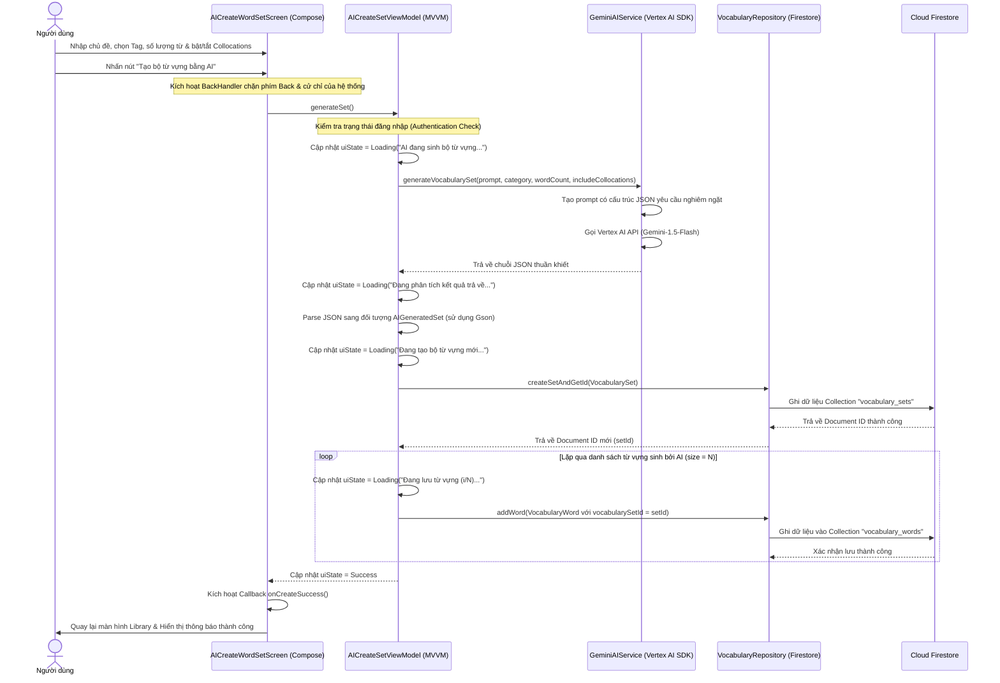

# 🤖 Tài Liệu Đặc Tả Kỹ Thuật: Tính Năng Sinh Bộ Từ Vựng Tự Động Bằng AI (AI Word Set Generator)

Tài liệu này đặc tả chi tiết kiến trúc phần mềm, nguyên lý thiết kế, cấu trúc dữ liệu, prompt engineering và hướng dẫn kiểm thử cho tính năng **AI Word Set Generator** trong dự án **MinLish**. Tài liệu tuân thủ tuyệt đối các nguyên tắc SOLID, nguyên tắc bảo mật Firebase, và triết lý Clean Architecture.

---

## 📋 1. Tổng Quan Tính Năng

Tính năng **AI Word Set Generator** cho phép người học tự thiết kế lộ trình học từ vựng riêng biệt bằng cách cung cấp yêu cầu bằng ngôn ngữ tự nhiên. Hệ thống kết hợp sức mạnh của mô hình ngôn ngữ lớn **Gemini 1.5 Flash** (thông qua Vertex AI in Firebase SDK) để phân tích yêu cầu, tự động biên soạn nội dung học tập chất lượng cao và đồng bộ vào Firestore Database của người dùng.

### Các chức năng chính:
* **Nhập chủ đề tùy biến (Free-form Prompt)**: Người học có thể yêu cầu bất cứ ngữ cảnh cụ thể nào. Ví dụ: *"Tiếng Anh chuyên ngành Logistics"*, *"Từ vựng thông dụng khi đi du lịch tự túc Nhật Bản"*, *"Từ vựng miêu tả các cung bậc cảm xúc vui vẻ"*.
* **Phân loại lĩnh vực (Tagging)**: Hỗ trợ gắn thẻ nhanh (IELTS, TOEIC, Daily, Business, Travel, General) để AI điều chỉnh độ khó của từ và văn phong câu ví dụ.
* **Số lượng từ linh hoạt**: Phạm vi rộng từ **5 đến 50 từ** (với các bước tăng 5 đơn vị) để tối ưu hóa thời gian sinh dữ liệu và kích thước phản hồi.
* **Bật/Tắt cụm từ đi kèm (Collocations)**: Tùy biến bổ sung các cụm từ thường đi kèm phổ biến để tăng khả năng giao tiếp tự nhiên của học viên.
* **Quy trình hoạt động an toàn**: Có cơ chế chặn thoát màn hình (Back-lock) khi đang tạo để tránh làm hỏng cấu trúc dữ liệu trên Firestore hoặc rò rỉ tài nguyên mạng.

---

## 🔄 2. Sơ Đồ Quy Trình Hoạt Động (Sequence Diagram)

Quy trình phát triển tuân thủ triệt để mô hình MVVM và nguyên tắc Clean Architecture:



---

## 📐 3. Áp Dụng Các Nguyên Tắc SOLID & Design Patterns

Để hệ thống dễ bảo trì và có khả năng mở rộng tốt nhất, mã nguồn được thiết kế chặt chẽ theo các nguyên lý SOLID:

### 3.1 Single Responsibility Principle (SRP - Nguyên tắc đơn trách nhiệm)
Mỗi lớp chỉ đảm nhận duy nhất một chức năng cốt lõi:
* `GeminiAIService`: Chỉ chịu trách nhiệm kết nối với Firebase AI SDK, xây dựng prompt và trả về kết quả thô từ AI. Lớp này không biết về cơ sở dữ liệu Firestore hay giao diện người dùng.
* `AICreateSetViewModel`: Chịu trách nhiệm quản lý State Machine của UI, kiểm tra tính hợp lệ của dữ liệu nhập vào, phân tích cú pháp JSON (sử dụng GSON) và điều phối việc ghi dữ liệu.
* `FirestoreVocabularyRepositoryImpl`: Chỉ chịu trách nhiệm thực thi các câu lệnh truy vấn và ghi dữ liệu thô vào các collection trên Firebase Cloud Firestore.

### 3.2 Open/Closed Principle (OCP - Nguyên tắc đóng/mở)
* Màn hình thiết kế các Tag, Slider cấu hình dựa trên cơ chế cấu hình động. Lớp dữ liệu trung gian `AIGeneratedSet` và `VocabularyWord` có thể dễ dàng bổ sung các trường thông tin mới (như độ khó từ vựng, cấp độ CEFR, các liên kết hình ảnh) mà không làm phá vỡ hoặc yêu cầu sửa đổi cấu trúc cốt lõi của các repository hiện tại.

### 3.3 Dependency Inversion Principle (DIP - Nguyên tắc đảo ngược phụ thuộc)
* `AICreateSetViewModel` phụ thuộc vào interface trừu tượng `VocabularyRepository` chứ không phụ thuộc trực tiếp vào lớp cài đặt cụ thể `FirestoreVocabularyRepositoryImpl`. Điều này cho phép dễ dàng chuyển đổi sang lưu trữ local (Room DB/SQLite) hoặc mock repository để viết Unit Test mà không cần sửa đổi bất kỳ dòng code logic nào trong ViewModel.

---

## 💾 4. Thiết Kế Cơ Sở Dữ Liệu & Data Models

### 4.1 Cấu trúc Dữ liệu Parse từ AI (`AIGeneratedSet.kt`)
Tệp tin: `com.edu.minlish.core.ai.model.AIGeneratedSet.kt`

```kotlin
package com.edu.minlish.core.ai.model

import com.edu.minlish.features.library.domain.model.WordDefinition

data class AIGeneratedWord(
    val word: String,
    val pronunciation: String,
    val definitions: List<WordDefinition>,
    val collocations: String = "",
    val personalNote: String = ""
)

data class AIGeneratedSet(
    val title: String,
    val description: String,
    val words: List<AIGeneratedWord>
)
```

### 4.2 Thiết Kế Bản Bản Ghi Dữ Liệu Lớp Nghiệp Vụ (Business Logic Models)
Hai thực thể chính được tích hợp với Firestore gồm:

#### Bộ từ vựng (`VocabularySet.kt`):
```kotlin
data class VocabularySet(
    val id: String = "",
    val creatorId: String = "",
    val title: String = "",
    val description: String = "",
    val category: String = "",
    val wordCount: Int = 0,
    val isPublic: Boolean = false,
    val createdAt: Date = Date()
)
```

#### Từ vựng chi tiết (`VocabularyWord.kt`):
```kotlin
data class VocabularyWord(
    val id: String = "",
    val vocabularySetId: String = "",
    val word: String = "",
    val pronunciation: String = "",
    val definitions: List<WordDefinition> = emptyList(),
    val collocations: String = "",
    val personalNote: String = "",
    val createdAt: Date = Date()
)
```

---

## 🧠 5. Prompt Engineering (Định Dạng Chỉ Thị Cho AI)

Để đảm bảo mô hình ngôn ngữ lớn **Gemini 1.5 Flash** luôn trả về dữ liệu có định dạng JSON sạch và cấu trúc ổn định, prompt được thiết kế chi tiết:

```kotlin
val fullPrompt = """
    Bạn là một chuyên gia soạn thảo giáo trình tiếng Anh. Hãy tạo một bộ từ vựng cho chủ đề: "$prompt".
    Yêu cầu:
    - Số lượng từ: $wordCount từ.
    - Thể loại: $category.
    - Bao gồm cụm từ đi kèm (collocations): ${if (includeCollocations) "Có" else "Không"}.
    
    Trả về kết quả DƯỚI DẠNG JSON hợp lệ theo cấu trúc sau, KHÔNG ĐƯỢC có các thẻ markdown bao quanh:
    {
      "title": "Tên bộ từ vựng hấp dẫn",
      "description": "Mô tả ngắn gọn về bộ từ vựng",
      "words": [
        {
          "word": "từ_vựng",
          "pronunciation": "phiên_âm_IPA",
          "definitions": [
            {
              "pos": "Noun/Verb/...",
              "meaningVietnamese": "nghĩa tiếng Việt",
              "definitionEnglish": "English definition",
              "exampleSentence": "Câu ví dụ",
              "synonyms": ["đồng nghĩa"],
              "antonyms": ["trái nghĩa"]
            }
          ],
          "collocations": "cụm từ đi kèm",
          "personalNote": "ghi chú"
        }
      ]
    }
""".trimIndent()
```

### Kỹ thuật xử lý chuỗi JSON thô:
Đôi khi AI vẫn có thể trả về các thẻ định dạng markdown (như ` ```json ` ở đầu và ` ``` ` ở cuối). Lớp ViewModel thực hiện bộ lọc để làm sạch chuỗi trước khi chuyển đổi bằng Gson:
```kotlin
val cleanJson = if (jsonStr.contains("```json")) {
    jsonStr.substringAfter("```json").substringBeforeLast("```").trim()
} else if (jsonStr.contains("```")) {
    jsonStr.substringAfter("```").substringBeforeLast("```").trim()
} else {
    jsonStr.trim()
}
```

---

## 🎨 6. Thiết Kế Trải Nghiệm Giao Diện Người Dùng (UI/UX)

Giao diện được viết bằng **Jetpack Compose** tuân thủ bảng màu và thiết kế hệ thống của MinLish:

### 6.1 Các Component Nổi Bật:
* **Slider Chọn Số Lượng Từ vựng**: Cung cấp khoảng chạy từ **5 đến 50 từ** với `steps = 8` (tương ứng các bước tăng 5 từ một nấc: 5, 10, 15, ..., 50).
* **Tag Chips FlowRow**: Hỗ trợ tự động xuống dòng và co giãn mượt mà khi người dùng tương tác chọn loại nhãn phân loại (TOEIC, IELTS...).
* **Bảo vệ Trạng thái Lưu dữ liệu (Anti-Cancellation System)**:
  * Khi tiến hành gửi và lưu dữ liệu, hệ thống kích hoạt **`BackHandler(enabled = true)`** chặn toàn bộ cử chỉ vuốt quay lại hoặc phím Back cứng của điện thoại Android.
  * Nút quay lại (IconButton Back ở TopBar) được liên kết trực tiếp với trạng thái tải: `enabled = uiState !is AICreateSetUiState.Loading`.
  * Hộp thoại Overlay Loading mờ 60% hiển thị trạng thái động báo cáo quá trình xử lý thời gian thực, giúp người dùng cảm thấy ứng dụng đang phản hồi tốt.

---

## 🛠️ 7. Xử Lý Sự Cố & Câu Hỏi Thường Gặp (Troubleshooting & FAQ)

### 7.1 Lỗi Build Gradle liên quan đến `jlink.exe`
* **Triệu chứng**: `Execution failed for task ':app:compileDebugJavaWithJavac'`. Gradle tìm kiếm `jlink.exe` trong thư mục tiện ích mở rộng IDE và báo lỗi không tồn tại.
* **Nguyên nhân**: Gradle Daemon tự động quét và nhận diện nhầm JRE của Java VS Code Extension là một JDK cài đặt trên máy.
* **Giải pháp**: Thêm cấu hình `org.gradle.java.installations.auto-detect=false` vào `gradle.properties` để ngăn chặn Gradle quét các thư mục cài đặt phần mềm bên ngoài, từ đó bắt buộc Gradle tự tải xuống bản OpenJDK chuẩn.

### 7.2 Tại sao giới hạn tối đa là 50 từ mà không phải 100 từ?
* Phản hồi JSON cho 100 từ kèm theo định nghĩa tiếng Anh, tiếng Việt, câu ví dụ và collocations có thể vượt quá **15,000 tokens**. Điều này sẽ vượt quá giới hạn token đầu ra của mô hình Gemini 1.5 Flash trong một lượt phản hồi và gây ra timeout đường truyền hoặc dữ liệu JSON bị cắt cụt (lỗi cú pháp JSON). Giới hạn **50 từ** là điểm cân bằng hoàn hảo giữa tính ổn định và lượng kiến thức học tập trong một bộ từ.

---

## 🧪 8. Kế Hoạch Kiểm Thử Chi Tiết (Verification Plan)

### 8.1 Kiểm thử tự động (Automated Validation)
Chạy lệnh biên dịch mã nguồn của dự án để đảm bảo tất cả các thay đổi không phát sinh lỗi cú pháp:
```bash
./gradlew compileDebugKotlin
```

### 8.2 Các ca kiểm thử thủ công (Manual Test Cases)
| Mã ca kiểm thử | Tên ca kiểm thử | Các bước thực hiện | Kết quả mong đợi |
| :--- | :--- | :--- | :--- |
| **TC-01** | Kiểm tra hiển thị Bottom Sheet lựa chọn | 1. Mở màn hình Thư viện (Library)<br>2. Nhấn nút FAB "+"<br>3. Kiểm tra Bottom Sheet hiện lên. | Bottom Sheet xuất hiện với hai lựa chọn: "Tự tạo thủ công" và "Tạo nhanh bằng AI". |
| **TC-02** | Sinh từ vựng thành công với Collocations | 1. Chọn "Tạo nhanh bằng AI"<br>2. Nhập prompt: *"Từ vựng về năng lượng xanh"*<br>3. Kéo số lượng từ: 15 từ<br>4. Bật Switch "Collocations"<br>5. Bấm "Tạo bộ từ vựng bằng AI". | - Overlay loading hiện lên.<br>- Tiến độ lưu từ hiển thị từ 0/15 đến 15/15.<br>- Tự động quay lại Library, bộ từ mới xuất hiện có đầy đủ cụm từ đi kèm. |
| **TC-03** | Sinh từ vựng thành công không kèm Collocations | 1. Nhập prompt: *"Từ vựng văn phòng"*<br>2. Tắt Switch "Collocations"<br>3. Bấm Tạo. | Bộ từ vựng được sinh ra thành công, xem chi tiết các từ thấy trường cụm từ đi kèm để trống. |
| **TC-04** | Kiểm tra cơ chế chặn thoát (Anti-Cancellation) | 1. Nhập prompt và bấm Tạo bộ từ<br>2. Khi màn hình đang Loading, nhấn phím Back cứng hoặc vuốt Back trên thiết bị. | Hệ thống không phản hồi với cử chỉ Back, người dùng tiếp tục ở màn hình Loading cho đến khi hoàn tất. |
| **TC-05** | Kiểm tra xử lý lỗi khi nhập dữ liệu rỗng | 1. Để trống ô nhập chủ đề<br>2. Kiểm tra trạng thái nút bấm Tạo bộ từ. | Nút bấm Tạo bộ từ vựng bị vô hiệu hóa (disabled) và không thể bấm click. |
