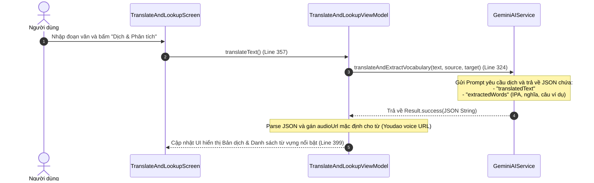
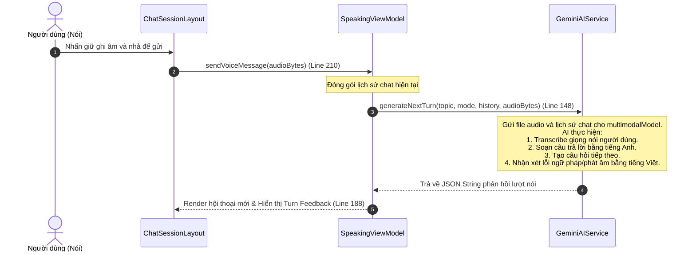

# Tích hợp Gemini AI chuyên sâu trong MinLish

Ứng dụng **MinLish** khai thác tối đa sức mạnh của mô hình ngôn ngữ lớn (Gemini AI) thông qua bộ SDK **Vertex AI in Firebase** để cung cấp các tính năng học tập thông minh cá nhân hóa. Tài liệu này mô tả chi tiết cách tích hợp kỹ thuật và các luồng dữ liệu AI.

---

## 1. Cơ chế kết nối SDK (Vertex AI in Firebase)

Toàn bộ logic kết nối với Gemini AI được đóng gói trong lớp [GeminiAIService.kt](file:///D:/Fullit/projects/Android/MinLish/app/src/main/java/com/edu/minlish/core/ai/GeminiAIService.kt#L16).
* **Mô hình sử dụng**: Mặc định là `gemini-1.5-flash`, được cấu hình động thông qua file `local.properties` (đọc qua BuildConfig). Việc sử dụng mô hình này đảm bảo độ ổn định tối đa, tránh lỗi mô hình không được hỗ trợ trên một số vùng Cloud của Vertex AI và hỗ trợ đầy đủ xử lý đa phương tiện (Multimodal).
* **Tách biệt Model Instance**:
  * **`textModel` (Line 21)**: Dùng cấu hình `temperature = 0.1f` (Line 25) và định dạng phản hồi JSON bắt buộc (`responseMimeType = "application/json"`) để đảm bảo kết quả trả về có tính cấu trúc chuẩn xác và ổn định.
  * **`multimodalModel` (Line 32)**: Dùng cấu hình `temperature = 0.0f` (Line 36) chuyên dụng cho việc nhận diện giọng nói (Audio) và xử lý đa phương tiện.

---

## 2. Luồng Dịch thuật & Trích xuất Từ vựng (Translation & Vocabulary Extraction)

Khi người dùng nhập một đoạn văn bản tiếng Anh dài trong màn hình dịch thuật, ứng dụng không chỉ dịch mà còn tự động trích xuất các từ vựng cốt lõi.

---

## 3. Luyện nói tiếng Anh thông minh (AI Speaking Practice)

Phân hệ `speaking` cung cấp trải nghiệm tương tác giọng nói thời gian thực.
* Người dùng nói bằng cách giữ nút ghi âm và gửi file âm thanh dạng `.mp4` ([SpeakingScreen.kt](file:///D:/Fullit/projects/Android/MinLish/app/src/main/java/com/edu/minlish/features/speaking/presentation/SpeakingScreen.kt)).
* [SpeakingViewModel.kt](file:///D:/Fullit/projects/Android/MinLish/app/src/main/java/com/edu/minlish/features/speaking/presentation/viewmodel/SpeakingViewModel.kt) tiếp nhận âm thanh, chuyển thành `ByteArray` và gọi Gemini.

### Cơ chế chống nhiễu / lọc tiếng click nút (Voice Activity Detection - VAD ở Client)
Để ngăn chặn tình trạng AI "tự chế thoại" (hallucination) từ các tệp ghi âm chỉ chứa tiếng chạm tay bấm nút START/STOP hoặc hơi thở nhẹ của người dùng khi im lặng, ứng dụng áp dụng 3 cơ chế lọc âm cục bộ trước khi gửi lên API:
1. **Bỏ qua nhiễu nút bấm bắt đầu**: Trong [AudioRecorder.kt](file:///D:/Fullit/projects/Android/MinLish/app/src/main/java/com/edu/minlish/core/util/AudioRecorder.kt), tiến trình poll biên độ âm lượng được trì hoãn `350ms` (`delay(350)`) sau khi bắt đầu ghi âm để loại bỏ hoàn toàn âm thanh cơ học của tiếng tap nút START.
2. **Tăng ngưỡng biên độ**: Ngưỡng âm lượng phát hiện giọng nói `AMPLITUDE_THRESHOLD` được nâng lên `2000` (tránh bắt các tiếng thì thầm hay tiếng ồn nền nhẹ).
3. **Yêu cầu độ dài lời nói tối thiểu**: [SpeakingViewModel.kt](file:///D:/Fullit/projects/Android/MinLish/app/src/main/java/com/edu/minlish/features/speaking/presentation/viewmodel/SpeakingViewModel.kt) đếm số lượng sample vượt ngưỡng. Ứng dụng yêu cầu ít nhất `8` samples (tương đương khoảng `400ms` nói thực tế) để cấu thành một từ vựng tối thiểu. Nếu thấp hơn ngưỡng này, hệ thống sẽ chặn gửi gói tin lên Gemini và hiển thị ngay thông báo lỗi *"Không nghe rõ giọng nói. Vui lòng nói to rõ hơn và thử lại!"*.

### Luồng hội thoại nhiều lượt (Multi-turn Speaking Conversation)

---

## 4. Áp dụng Design Patterns: Strategy & Factory cho Tra cứu Từ điển

Để hỗ trợ khả năng chuyển đổi linh hoạt nguồn cấp dữ liệu tra cứu từ vựng (Tra cứu bằng Gemini AI hoặc Oxford Dictionary API thông thường) mà không phải sửa đổi code ở Presentation Layer, MinLish áp dụng **Strategy Pattern**:

1. **[LookupStrategy.kt](file:///D:/Fullit/projects/Android/MinLish/app/src/main/java/com/edu/minlish/features/library/domain/repository/LookupStrategy.kt)**: Định nghĩa interface chung cho việc tra từ.
2. **[GeminiLookupStrategy.kt](file:///D:/Fullit/projects/Android/MinLish/app/src/main/java/com/edu/minlish/features/library/data/repository/GeminiLookupStrategy.kt)**: Triển khai tra cứu thông minh sử dụng Gemini AI.
3. **[DictionaryApiLookupStrategy.kt](file:///D:/Fullit/projects/Android/MinLish/app/src/main/java/com/edu/minlish/features/library/data/repository/DictionaryApiLookupStrategy.kt)**: Triển khai tra cứu bằng API từ điển REST thông thường.
4. **[LookupStrategyFactory.kt](file:///D:/Fullit/projects/Android/MinLish/app/src/main/java/com/edu/minlish/features/library/data/repository/LookupStrategyFactory.kt)**: Factory Class chịu trách nhiệm khởi tạo chiến lược tra cứu phù hợp dựa trên cài đặt của người dùng.

---

## 5. Tài liệu tham khảo (References)

* **Design Patterns: Elements of Reusable Object-Oriented Software**: Gamma, Helm, Johnson, Vlissides (Gang of Four).
* **Vertex AI in Firebase Multimodal Prompts Guide**: Google Cloud documentation.
