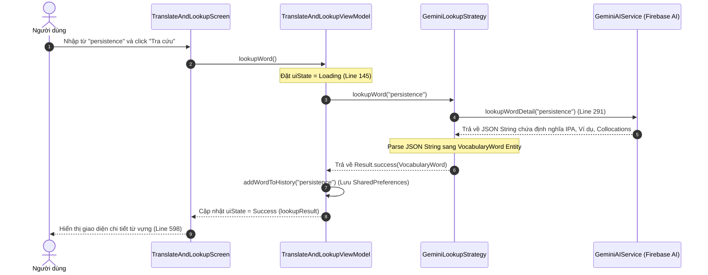
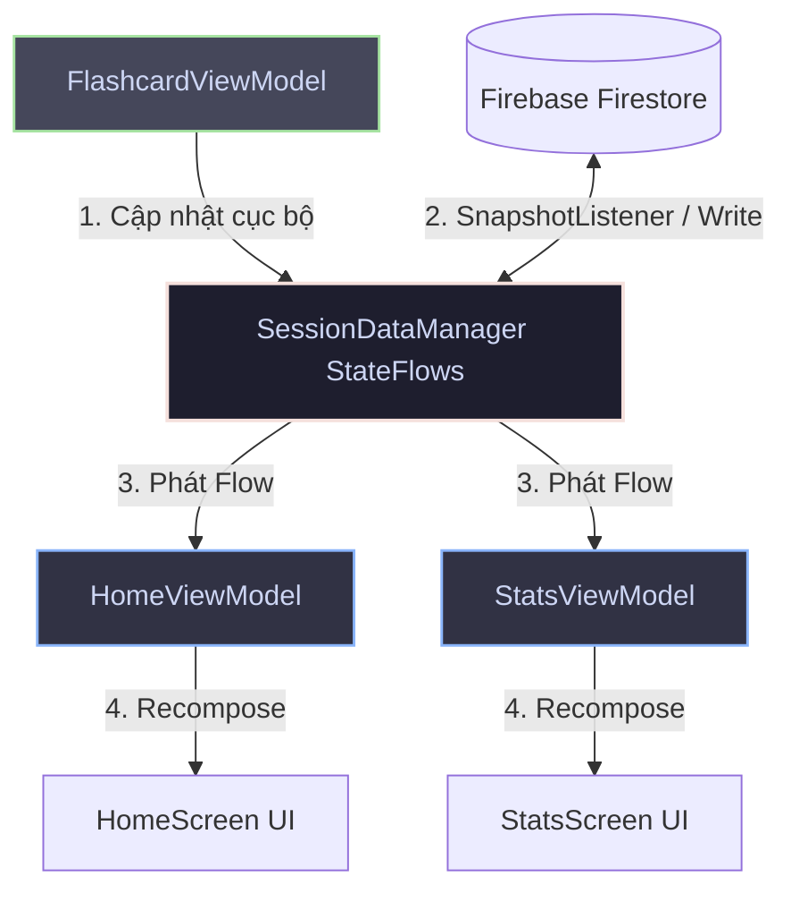

# Kiến trúc & Hệ thống Điều hướng MinLish

Ứng dụng **MinLish** được thiết kế để đảm bảo khả năng kiểm thử (testability), khả năng mở rộng (scalability) và sự tách biệt tuyệt đối giữa các tầng logic nghiệp vụ với các thư viện bên thứ ba. Tài liệu này cung cấp cái nhìn chi tiết về cách tổ chức kiến trúc của hệ thống.

---

## 1. Tại sao dùng Clean Architecture? (Overview)

Trong quá trình phát triển ứng dụng di động, các framework giao diện (UI) hoặc dịch vụ Backend (như Firebase, REST API) có xu hướng thay đổi liên tục. Nếu chúng ta viết logic nghiệp vụ (như tính toán Streak, lưu trữ từ vựng) trực tiếp trong các Class liên quan đến UI hoặc SDK Firebase:
* **Khó kiểm thử**: Muốn test thuật toán phải giả lập (mock) toàn bộ Android Context hoặc Firebase Emulator.
* **Mất kiểm soát mã nguồn**: Sự thay đổi của thư viện bên ngoài sẽ phá vỡ logic cốt lõi.

**Giải pháp của MinLish**: Áp dụng **Clean Architecture** để tách logic nghiệp vụ thành một "lõi" độc lập (Domain Layer), cô lập nó khỏi những biến động bên ngoài.

---

## 2. Kiến trúc 3 lớp (Three-Layer Architecture)

Mã nguồn được phân tách rõ ràng thành 3 lớp phân cấp từ ngoài vào trong:

```mermaid
graph TD
    %% Node styles for dark theme
    classDef layerFill fill:#2d333b,stroke:#6d5dfc,stroke-width:2px,color:#e6edf3;
    classDef domainFill fill:#1c2128,stroke:#8b949e,stroke-width:2px,color:#e6edf3;
    
    subgraph Layer3 ["Presentation Layer (Outer)"]
        UI[Compose Screens UIs]:::layerFill
        VM[ViewModels State Holders]:::layerFill
    end

    subgraph Layer2 ["Domain Layer (Core Business)"]
        UC[Use Cases Actions]:::domainFill
        RepoInterface[Repository Interfaces]:::domainFill
        Models[Domain Entity Models]:::domainFill
    end

    subgraph Layer1 ["Data Layer (Outer Infrastructure)"]
        RepoImpl[Repository Implementations]:::layerFill
        API[API / Firestore Services]:::layerFill
    end

    %% Dependency flow
    UI --> VM
    VM --> UC
    UC --> Models
    UC --> RepoInterface
    RepoImpl -.->|Implements| RepoInterface
    RepoImpl --> API

    style Layer3 fill:#161b22,stroke:#30363d,stroke-width:1px
    style Layer2 fill:#161b22,stroke:#30363d,stroke-width:1px
    style Layer1 fill:#161b22,stroke:#30363d,stroke-width:1px
```



### A. Presentation Layer (Tầng hiển thị)
* **Vai trò**: Chịu trách nhiệm render giao diện và phản hồi các thao tác của người dùng.
* **Thành phần**:
  * **Compose Screens**: Vẽ giao diện bằng khai báo thuần túy, ví dụ [HomeScreen.kt](file:///D:/Fullit/projects/Android/MinLish/app/src/main/java/com/edu/minlish/features/home/presentation/HomeScreen.kt#L45) hay [TranslateAndLookupScreen.kt](file:///D:/Fullit/projects/Android/MinLish/app/src/main/java/com/edu/minlish/features/library/presentation/TranslateAndLookupScreen.kt#L45).
  * **ViewModels**: Nơi giữ trạng thái giao diện (UiState) và điều phối các sự kiện, ví dụ [TranslateAndLookupViewModel.kt](file:///D:/Fullit/projects/Android/MinLish/app/src/main/java/com/edu/minlish/features/library/presentation/viewmodel/TranslateAndLookupViewModel.kt#L15).

### B. Domain Layer (Tầng nghiệp vụ cốt lõi)
* **Vai trò**: Trọng tâm của ứng dụng. Chứa các thực thể dữ liệu và nghiệp vụ thuần túy của ứng dụng, không phụ thuộc vào bất kỳ thư viện Android nào.
* **Thành phần**:
  * **Domain Models**: Định nghĩa thực thể dữ liệu như [VocabularyWord.kt](file:///D:/Fullit/projects/Android/MinLish/app/src/main/java/com/edu/minlish/features/library/domain/model/VocabularyWord.kt).
  * **Repository Interfaces**: Định nghĩa các giao thức lưu trữ dữ liệu, ví dụ `VocabularyRepository.kt`.
  * **Use Cases (Interactors)**: Đại diện cho một hành động nghiệp vụ duy nhất, ví dụ [BuildQuizQuestionsUseCase.kt](file:///D:/Fullit/projects/Android/MinLish/app/src/main/java/com/edu/minlish/features/learning/domain/usecase/BuildQuizQuestionsUseCase.kt#L10).

### C. Data Layer (Tầng dữ liệu)
* **Vai trò**: Triển khai các Repository Interfaces từ Domain Layer, tương tác trực tiếp với Database, Network API hoặc Local Storage.
* **Thành phần**:
  * **Repository Implementations**: Ví dụ [FirestoreVocabularyRepositoryImpl.kt](file:///D:/Fullit/projects/Android/MinLish/app/src/main/java/com/edu/minlish/features/library/data/repository/FirestoreVocabularyRepositoryImpl.kt#L15).
  * **Services / DataSources**: Các SDK kết nối dịch vụ ngoài, ví dụ [GeminiAIService.kt](file:///D:/Fullit/projects/Android/MinLish/app/src/main/java/com/edu/minlish/core/ai/GeminiAIService.kt#L16).

---

## 3. Hệ thống Điều hướng (Navigation System)

Hệ thống điều hướng trong MinLish được tập trung quản lý thông qua:
1. **[Screen.kt](file:///D:/Fullit/projects/Android/MinLish/app/src/main/java/com/edu/minlish/core/navigation/Screen.kt#L1)**: Định nghĩa toàn bộ Route của ứng dụng dưới dạng các `sealed class`.
2. **[MinLishApp.kt](file:///D:/Fullit/projects/Android/MinLish/app/src/main/java/com/edu/minlish/MinLishApp.kt#L42)**: Thiết lập `NavHost`, liên kết các Route với các Composable Screens tương ứng và điều phối việc hiển thị Bottom Navigation.

### Cơ chế hiển thị Bottom Bar động
Trong [MinLishApp.kt:48-65](file:///D:/Fullit/projects/Android/MinLish/app/src/main/java/com/edu/minlish/MinLishApp.kt#L48-L65), danh sách các Route được hiển thị Bottom Navigation được lọc động:
```kotlin
val showBottomBarRoutes = listOf(
    Screen.Home.route,
    Screen.Library.route,
    Screen.Stats.route,
    Screen.PersonalProfile.route,
    Screen.TranslateAndLookup.route,
    Screen.WordList.route,
    Screen.WordDetail.route
)
```
Nếu màn hình hiện tại thuộc danh sách trên (hoặc là các sub-route), ứng dụng sẽ tự động chèn thanh Bottom Navigation từ component [MinLishBottomNav.kt](file:///D:/Fullit/projects/Android/MinLish/app/src/main/java/com/edu/minlish/core/designsystem/component/MinLishBottomNav.kt#L29).

---

## 4. Quy trình Luồng Dữ liệu (Data Flow)

Để hiểu cách dữ liệu di chuyển trong hệ thống, hãy xem sơ đồ tuần tự dưới đây mô tả hành động **Tra từ điển** của người dùng ở tab "Tra cứu từ":



### 4.1. Cơ chế Reactive Cache & Single Source of Truth (SSOT)

Để loại bỏ hoàn toàn độ trễ giao diện và giải quyết các lỗi bất đồng bộ tiến trình (ví dụ: học xong từ mới quay lại màn hình Home/Stats chưa thấy số liệu đổi), MinLish triển khai mô hình Reactive Cache toàn cục:



1. **Single Source of Truth (SSOT)**: Lớp [SessionDataManager.kt](file:///D:/Fullit/projects/Android/MinLish/app/src/main/java/com/edu/minlish/core/util/SessionDataManager.kt) được nâng cấp thành kho dữ liệu Reactive sử dụng Kotlin `StateFlow`.
2. **Global SnapshotListeners**: Ngay khi đăng nhập, `preFetchUserData()` kích hoạt các Firestore `addSnapshotListener` toàn cục, tự động lắng nghe và nạp dữ liệu mới nhất từ Cloud vào cache.
3. **Cập nhật UI Tức thời**: Khi người dùng chấm điểm từ vựng (Flashcard/Quiz), `FlashcardViewModel` sẽ ghi trực tiếp kết quả mới vào `SessionDataManager` (local update). Các ViewModel (`HomeViewModel`, `StatsViewModel`) đăng ký lắng nghe Flow sẽ nhận sự thay đổi cục bộ này ngay lập tức và tính toán lại `uiState` giúp cập nhật giao diện trong tích tắc mà không cần chờ phản hồi mạng từ server.

---

## 5. Hệ thống Design System & Theme

Quy chuẩn thiết kế giao diện của MinLish tuân thủ nghiêm ngặt bảng màu được cấu hình tại [core/designsystem/theme/Color.kt](file:///D:/Fullit/projects/Android/MinLish/app/src/main/java/com/edu/minlish/core/designsystem/theme/Color.kt):

| Tên Token Màu | Mã Hex (ARGB) | Mục đích sử dụng | Dòng code tham chiếu |
| :--- | :--- | :--- | :--- |
| `Primary` | `0xFF111111` | Màu chủ đạo (Thương hiệu, Nút bấm đen premium) | [Color.kt:6](file:///D:/Fullit/projects/Android/MinLish/app/src/main/java/com/edu/minlish/core/designsystem/theme/Color.kt#L6) |
| `Background` | `0xFFFFFFFF` | Màu nền chính của màn hình | [Color.kt:9](file:///D:/Fullit/projects/Android/MinLish/app/src/main/java/com/edu/minlish/core/designsystem/theme/Color.kt#L9) |
| `Muted` | `0xFF6B6B6B` | Màu chữ phụ, mô tả ngắn | [Color.kt:15](file:///D:/Fullit/projects/Android/MinLish/app/src/main/java/com/edu/minlish/core/designsystem/theme/Color.kt#L15) |
| `Border` | `0xFFE5E5E5` | Màu đường viền ngăn cách | [Color.kt:16](file:///D:/Fullit/projects/Android/MinLish/app/src/main/java/com/edu/minlish/core/designsystem/theme/Color.kt#L16) |
| `Success` | `0xFF34A853` | Màu trạng thái hoàn thành/Đã lưu thành công | [Color.kt:20](file:///D:/Fullit/projects/Android/MinLish/app/src/main/java/com/edu/minlish/core/designsystem/theme/Color.kt#L20) |

Typography được thiết lập thống nhất trong [Type.kt](file:///D:/Fullit/projects/Android/MinLish/app/src/main/java/com/edu/minlish/core/designsystem/theme/Type.kt) nhằm cung cấp trải nghiệm đọc văn bản thoải mái nhất trên các thiết bị Android.

---

## 6. Tài liệu tham khảo (References)

* **Clean Architecture Concept**: Robert C. Martin (Uncle Bob).
* **Jetpack Compose Navigation Guide**: Official Android Developer documentation.
* **Vertex AI in Firebase SDK**: Google Firebase documentation.
