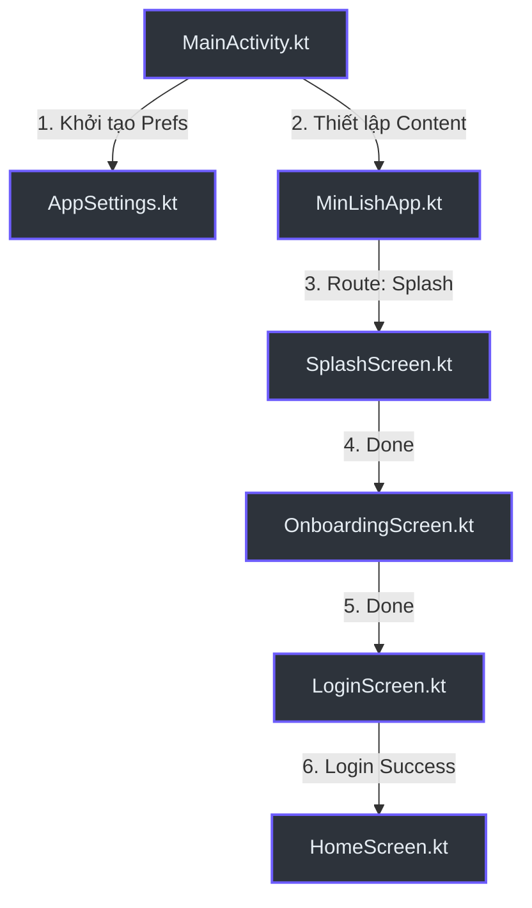
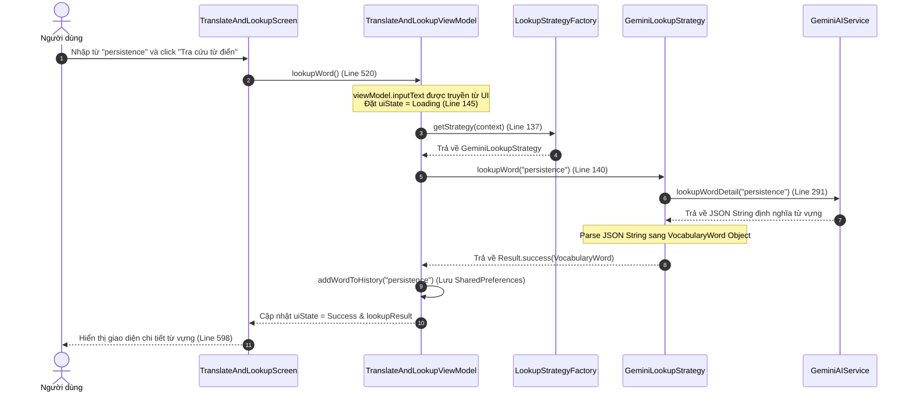
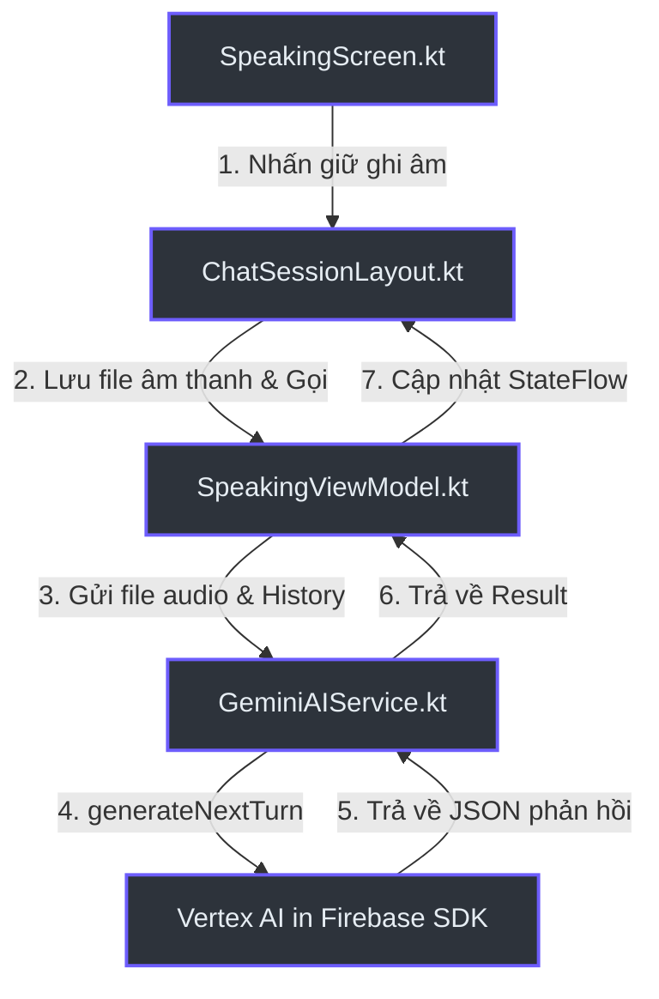

# Giải thích Chi tiết Luồng Code & Đường đi của File

Tài liệu này giải thích chi tiết cách các file code trong dự án **MinLish** liên kết và gọi lẫn nhau, đi từ giao diện người dùng (UI Component) xuống tầng xử lý logic nghiệp vụ và lưu trữ dữ liệu.

---

## 1. Luồng 1: Khởi chạy và Điều phối màn hình (Navigation & App Bootstrapping)

Khi người dùng mở ứng dụng lần đầu tiên:



### Chi tiết đường đi của code:
1. **[MainActivity.kt](file:///D:/Fullit/projects/Android/MinLish/app/src/main/java/com/edu/minlish/MainActivity.kt#L13)**: 
   - `onCreate()` là điểm chạy đầu tiên của ứng dụng.
   - Dòng 22 gọi `AppSettings.init(this)` để khởi tạo `SharedPreferences` dùng cho toàn bộ ứng dụng.
   - Dòng 25 thực hiện tự động đăng nhập (Auto-login) nếu người dùng đã có session Firebase bằng cách gọi `SessionDataManager.preFetchUserData(uid)`.
   - Dòng 39 gọi Composable `MinLishApp()` làm màn hình gốc.
2. **[MinLishApp.kt](file:///D:/Fullit/projects/Android/MinLish/app/src/main/java/com/edu/minlish/MinLishApp.kt#L42)**:
   - Dòng 43 khởi tạo `rememberNavController()`.
   - Dòng 88 khởi tạo `NavHost` với `startDestination = Screen.Splash.route` (Màn hình Splash chạy đầu tiên).
   - Dòng 94 đăng ký composable `SplashScreen`. Khi hoàn thành, gọi callback điều hướng người dùng tới màn hình Onboarding: `navController.navigate(Screen.Onboarding.route)`.
   - Dòng 216 đăng ký `HomeScreen` chạy khi route là `Screen.Home.route`.

---

## 2. Luồng 2: Tra cứu từ vựng (Lookup Word)

Khi người dùng mở tab **Tra cứu từ** và thực hiện tìm kiếm một từ tiếng Anh:



### Chi tiết đường đi của code:
1. **Giao diện (UI)**: [TranslateAndLookupScreen.kt](file:///D:/Fullit/projects/Android/MinLish/app/src/main/java/com/edu/minlish/features/library/presentation/TranslateAndLookupScreen.kt#L489)
   - Người dùng nhập từ vào `OutlinedTextField` liên kết với `viewModel.inputText` (dòng 504).
   - Bấm nút "Tra cứu từ điển" (dòng 519) sẽ kích hoạt sự kiện `onClick = { viewModel.lookupWord() }` (dòng 520).
2. **ViewModel**: [TranslateAndLookupViewModel.kt](file:///D:/Fullit/projects/Android/MinLish/app/src/main/java/com/edu/minlish/features/library/presentation/viewmodel/TranslateAndLookupViewModel.kt)
   - Hàm `lookupWord()` được gọi:
     ```kotlin
     fun lookupWord() {
         val word = inputText.trim()
         // ... Đặt uiState = Loading
         viewModelScope.launch {
             val strategy = LookupStrategyFactory.getStrategy(context)
             val result = strategy.lookupWord(word)
             // ... Xử lý Result và cập nhật uiState
         }
     }
     ```
3. **Strategy Pattern**:
   - [LookupStrategyFactory.kt](file:///D:/Fullit/projects/Android/MinLish/app/src/main/java/com/edu/minlish/features/library/data/repository/LookupStrategyFactory.kt): Dựa trên cài đặt trong `AppSettings`, quyết định trả về `GeminiLookupStrategy` hay `DictionaryApiLookupStrategy`.
   - [GeminiLookupStrategy.kt](file:///D:/Fullit/projects/Android/MinLish/app/src/main/java/com/edu/minlish/features/library/data/repository/GeminiLookupStrategy.kt#L17):
     - Hàm `lookupWord(word)` gọi `GeminiAIService.lookupWordDetail(word)`.
     - Phân tích kết quả JSON trả về thành đối tượng `VocabularyWord` và gán URL phát âm mặc định nếu trống.
4. **Service**: [GeminiAIService.kt](file:///D:/Fullit/projects/Android/MinLish/app/src/main/java/com/edu/minlish/core/ai/GeminiAIService.kt#L291)
   - Hàm `lookupWordDetail(word)` soạn Prompt tiếng Việt yêu cầu Gemini AI phân tích từ loại, IPA, nghĩa, ví dụ, collocations và mẹo nhớ dưới dạng cấu trúc JSON chuẩn.
   - Gửi yêu cầu qua `textModel.generateContent(prompt)`.

---

## 3. Luồng 3: Luyện nói tiếng Anh AI (AI Speaking Practice)

Mô tả luồng gửi tin nhắn thoại từ người dùng để AI phản hồi và đánh giá:



### Chi tiết đường đi của code:
1. **Giao diện (UI)**:
   - [SpeakingScreen.kt](file:///D:/Fullit/projects/Android/MinLish/app/src/main/java/com/edu/minlish/features/speaking/presentation/SpeakingScreen.kt): Quản lý vòng đời ghi âm.
   - [ChatSessionLayout.kt](file:///D:/Fullit/projects/Android/MinLish/app/src/main/java/com/edu/minlish/features/speaking/presentation/ChatSessionLayout.kt): Chứa nút Micro ghi âm. Khi người dùng nhả nút, file âm thanh được lưu tạm thời dưới dạng Byte Array và gọi hàm của ViewModel:
     `viewModel.sendVoiceMessage(audioBytes)`
2. **ViewModel**: [SpeakingViewModel.kt](file:///D:/Fullit/projects/Android/MinLish/app/src/main/java/com/edu/minlish/features/speaking/presentation/viewmodel/SpeakingViewModel.kt)
   - Hàm `sendVoiceMessage(audioBytes: ByteArray)` được gọi:
     - Tạo tin nhắn tạm thời của User đưa vào UI list.
     - Gọi `geminiAIService.generateNextTurn(topic, mode, chatHistory, audioBytes)`.
3. **Service**: [GeminiAIService.kt](file:///D:/Fullit/projects/Android/MinLish/app/src/main/java/com/edu/minlish/core/ai/GeminiAIService.kt#L148)
   - Hàm `generateNextTurn()` nhận Byte Array âm thanh và Lịch sử hội thoại.
   - Dòng 169 sử dụng hàm `content {}` của SDK để gửi dữ liệu đa phương tiện (Multimodal Input):
     - `inlineData(audioBytes, "audio/mp4")`: Đính kèm file ghi âm giọng nói.
     - `text(prompt)`: Đính kèm văn bản chỉ dẫn AI thực hiện: Transcribe âm thanh -> Viết câu trả lời -> Đưa ra câu hỏi tiếp theo -> Nhận xét ngữ pháp bằng Tiếng Việt.
   - Gọi `multimodalModel.generateContent(inputContent)` để lấy kết quả.

---

## 4. Luồng 4: Đồng bộ hóa Streak & Đóng băng Streak (Streak Freeze)

Khi người dùng click trang bị Streak Freeze ở tab Progress:

### Chi tiết đường đi của code:
1. **Stats UI**: [StatsScreen.kt](file:///D:/Fullit/projects/Android/MinLish/app/src/main/java/com/edu/minlish/features/stats/presentation/StatsScreen.kt#L98)
   - Nút "Equip Streak Freeze" được click, mở `AlertDialog` xác nhận.
   - Khi bấm **Equip** (dòng 385), code thực hiện cập nhật SharedPreferences cục bộ:
     ```kotlin
     com.edu.minlish.core.util.AppSettings.isStreakFreezeEquipped = true
     com.edu.minlish.core.util.AppSettings.streakFreezesLeft = freezesLeft
     ```
2. **Home UI**: [HomeScreen.kt](file:///D:/Fullit/projects/Android/MinLish/app/src/main/java/com/edu/minlish/features/home/presentation/HomeScreen.kt#L112)
   - Màn hình HomeScreen khi được hiển thị sẽ đọc trực tiếp từ `AppSettings`:
     ```kotlin
     if (com.edu.minlish.core.util.AppSettings.isStreakFreezeEquipped) {
         // Hiển thị huy hiệu tag xanh "Protected" kèm icon tuyết (Icons.Default.AcUnit)
     }
     ```

---

## 5. Luồng 5: Lên lịch Nhắc nhở Học tập (Daily Reminder Settings)

Khi người dùng cấu hình giờ nhắc học trong màn hình Settings:

### Chi tiết đường đi của code:
1. **Settings UI**: [SettingsScreen.kt](file:///D:/Fullit/projects/Android/MinLish/app/src/main/java/com/edu/minlish/features/settings/presentation/SettingsScreen.kt#L88)
   - Người dùng click vào mục `"Reminder Time"`.
   - Một `TimePickerDialog` của hệ thống Android được khởi tạo (dòng 105) với giờ phút hiện tại.
   - Khi người dùng chọn giờ xong (ví dụ: 08:35 PM), callback lưu giờ dưới dạng chuỗi `"20:35"` hoặc `"08:35 PM"`.
   - Khi người dùng bấm **Save Settings**, code khởi tạo Repository nhắc nhở:
     `val reminderRepo = WorkManagerReminderRepository(context)`
     Và gọi: `reminderRepo.scheduleDaily(reminderTimeState)`
2. **Repository**: [WorkManagerReminderRepository.kt](file:///D:/Fullit/projects/Android/MinLish/app/src/main/java/com/edu/minlish/core/notification/WorkManagerReminderRepository.kt#L23)
   - Hàm `scheduleDaily(timeString)` được gọi:
     - Phân tích chuỗi thời gian thành Hour và Minute.
     - Tính toán khoảng thời gian delay từ bây giờ cho đến lúc nhắc nhở (`initialDelay` - dòng 37).
     - Thiết lập `PeriodicWorkRequest` chạy định kỳ mỗi 1 ngày:
       `val workRequest = PeriodicWorkRequestBuilder<ReminderWorker>(1, TimeUnit.DAYS).setInitialDelay(...)`
     - Đăng ký vào hệ thống WorkManager:
       `WorkManager.getInstance(context).enqueueUniquePeriodicWork(...)` (dòng 43).
3. **Background Worker**: `ReminderWorker.kt` (ở background hệ thống)
   - Đúng giờ hẹn hàng ngày, WorkManager hệ thống tự động thức giấc và gọi hàm `doWork()` của `ReminderWorker`.
   - `ReminderWorker` gọi `NotificationHelper` để hiển thị thông báo đẩy lên màn hình khóa điện thoại của người dùng.
