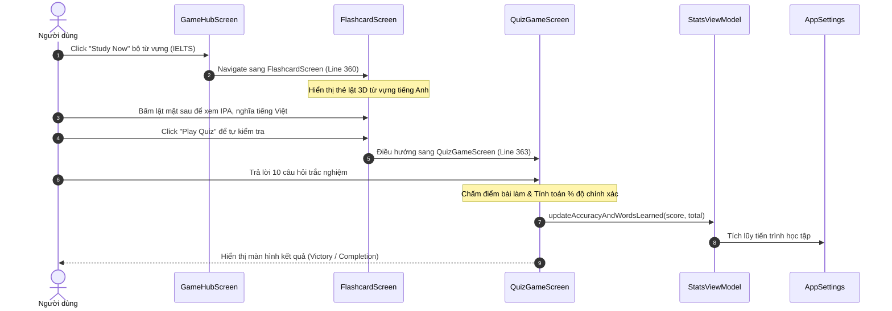
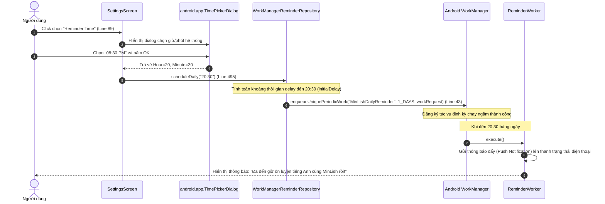

# Hướng dẫn Tính năng & Sơ đồ Luồng Nghiệp vụ MinLish

Tài liệu này cung cấp hướng dẫn chi tiết về cách hoạt động của 10 phân hệ tính năng trong ứng dụng MinLish, thuật toán Streak (Chuỗi ngày học liên tiếp) và cơ chế lên lịch gửi thông báo nhắc nhở bằng WorkManager.

---

## 1. Tổng quan 10 phân hệ tính năng (Feature List)

MinLish được chia tách thành các module chức năng độc lập nhằm mục tiêu dễ dàng mở rộng và bảo trì:

| Tên Module | Vai trò & Tính năng chính | Các File Code chính |
| :--- | :--- | :--- |
| **`auth`** | Đăng ký, đăng nhập và khôi phục mật khẩu qua Firebase Auth. | [LoginScreen.kt](file:///D:/Fullit/projects/Android/MinLish/app/src/main/java/com/edu/minlish/features/auth/presentation/LoginScreen.kt) |
| **`onboarding`** | Màn hình khởi động và các slide giới thiệu ứng dụng ban đầu. | [SplashScreen.kt](file:///D:/Fullit/projects/Android/MinLish/app/src/main/java/com/edu/minlish/features/onboarding/presentation/SplashScreen.kt) |
| **`home`** | Trang chủ hiển thị tiến độ học ngày hôm nay, Streak và phím tắt nhanh. | [HomeScreen.kt](file:///D:/Fullit/projects/Android/MinLish/app/src/main/java/com/edu/minlish/features/home/presentation/HomeScreen.kt) |
| **`library`** | Quản lý bộ từ vựng cá nhân, nhập/xuất file CSV từ vựng. | [LibraryScreen.kt](file:///D:/Fullit/projects/Android/MinLish/app/src/main/java/com/edu/minlish/features/library/presentation/LibraryScreen.kt) |
| **`translate`** | Dịch thuật đảo chiều (Anh-Việt) và trích xuất từ vựng bằng Gemini AI. | [TranslateAndLookupScreen.kt](file:///D:/Fullit/projects/Android/MinLish/app/src/main/java/com/edu/minlish/features/library/presentation/TranslateAndLookupScreen.kt) |
| **`learning`** | Học từ vựng bằng thẻ Flashcard (lật 3D) và mini game trắc nghiệm. | [FlashcardScreen.kt](file:///D:/Fullit/projects/Android/MinLish/app/src/main/java/com/edu/minlish/features/learning/presentation/FlashcardScreen.kt) |
| **`speaking`** | Luyện nói tiếng Anh AI, chấm điểm và gợi ý ngữ pháp chuẩn IELTS/TOEIC. | [SpeakingScreen.kt](file:///D:/Fullit/projects/Android/MinLish/app/src/main/java/com/edu/minlish/features/speaking/presentation/SpeakingScreen.kt) |
| **`stats`** | Thống kê tiến độ (Progress), trang bị Streak Freeze để giữ chuỗi học. | [StatsScreen.kt](file:///D:/Fullit/projects/Android/MinLish/app/src/main/java/com/edu/minlish/features/stats/presentation/StatsScreen.kt) |
| **`profilesetup`**| Thiết lập hồ sơ ban đầu (Mục tiêu học, cấp độ hiện tại). | [ProfileSetupScreen.kt](file:///D:/Fullit/projects/Android/MinLish/app/src/main/java/com/edu/minlish/features/profilesetup/presentation/ProfileSetupScreen.kt) |
| **`settings`** | Cấu hình bật/tắt nhắc nhở hàng ngày bằng TimePickerDialog hệ thống. | [SettingsScreen.kt](file:///D:/Fullit/projects/Android/MinLish/app/src/main/java/com/edu/minlish/features/settings/presentation/SettingsScreen.kt) |

---

## 2. Nghiệp vụ Học tập (Learning Flow)

Ứng dụng khuyến khích người dùng học thông qua việc chọn học bộ từ trong thư viện. Màn hình **Game Hub** đóng vai trò điều phối người dùng chọn chế độ học: Flashcard hoặc Chơi Quiz Game.

---

## 3. Thuật toán Bảo vệ Streak (Streak & Streak Freeze)

**Streak** (Số ngày học liên tục) là động lực to lớn giúp giữ chân người dùng. Tuy nhiên, nếu người dùng có việc bận đột xuất và không thể học, chuỗi Streak sẽ bị reset về `0`.

**Giải pháp**: Tính năng **Streak Freeze** cho phép đóng băng Streak.
* Trạng thái trang bị Streak Freeze (`isStreakFreezeEquipped`) được lưu bền vững qua SharedPreferences tại [AppSettings.kt:37](file:///D:/Fullit/projects/Android/MinLish/app/src/main/java/com/edu/minlish/core/util/AppSettings.kt#L37).
* Khi người dùng trang bị Streak Freeze trong [StatsScreen.kt:385](file:///D:/Fullit/projects/Android/MinLish/app/src/main/java/com/edu/minlish/features/stats/presentation/StatsScreen.kt#L385), trạng thái này được lưu lại vĩnh viễn và hiển thị huy hiệu xanh lá cây `"Protected"` kèm icon băng tuyết `AcUnit` trên [HomeScreen.kt:116](file:///D:/Fullit/projects/Android/MinLish/app/src/main/java/com/edu/minlish/features/home/presentation/HomeScreen.kt#L116).
* Vào cuối ngày (hệ thống kiểm tra tiến độ lúc 00:00):
  * Nếu người dùng chưa hoàn thành mục tiêu ngày (Today's Plan) **NHƯNG** đã trang bị Streak Freeze:
    * Streak được bảo toàn.
    * Trạng thái `isStreakFreezeEquipped` được đặt lại về `false`.
  * Nếu chưa hoàn thành mục tiêu ngày và **KHÔNG** trang bị Streak Freeze:
    * Streak reset về `0`.

---

## 4. Nghiệp vụ Nhắc nhở Hàng ngày (Daily Reminder Flow)

Để nhắc nhở người dùng học tập đúng giờ, MinLish sử dụng **WorkManager** để kích hoạt tác vụ chạy ngầm định kỳ 24 giờ một lần.

---

## 5. Tài liệu tham khảo (References)

* **Android WorkManager Guide**: Jetpack Libraries.
* **Kotlin SharedPreferences Delegate Pattern**: Android best practices.
