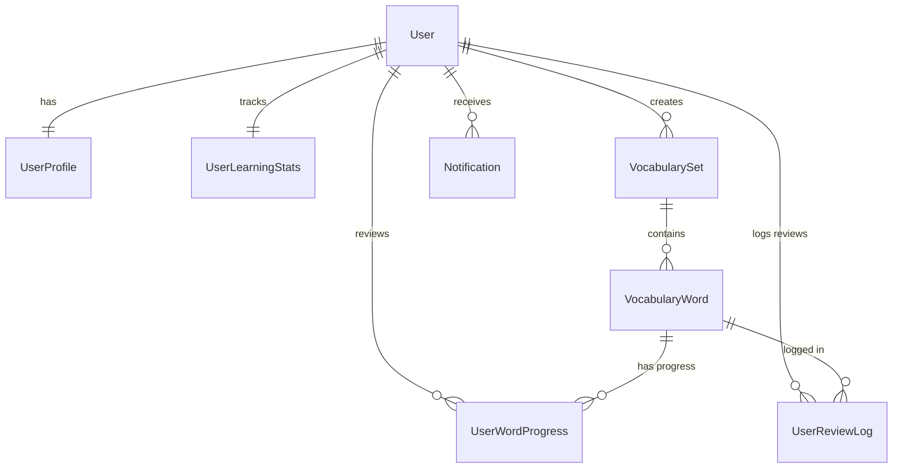

# 🏆 Kế hoạch phát triển hệ thống & Phân công công việc dự án MinLish (Bản Chính Thức - Đầy Đủ)

Tài liệu này là cẩm nang thiết kế và phát triển chính thức cho ứng dụng **MinLish**, được xây dựng để cung cấp cái nhìn toàn diện từ thiết kế cơ sở dữ liệu, phân quyền (User/Admin), mô tả giao diện chi tiết, phân công công việc (UI & Logic cho cả 4 thành viên), và các tính năng nâng cao để đạt điểm tối đa.

---

## 🔐 1. Thiết kế Phân quyền (Role-Based Access Control - RBAC)

Hệ thống được thiết kế để phân chia rõ ràng hai vai trò người dùng nhằm nâng cao tính thực tiễn và bảo mật:

### 1.1 Sơ đồ cơ sở dữ liệu phân quyền (Updated Database Schema)
Chúng ta sẽ bổ sung trường `role` vào bảng `User`, trường `isPublic` vào `VocabularySet` và tạo thêm bảng `UserReviewLog` để lưu lịch sử học tập.



#### Chi tiết các trường dữ liệu cần chỉnh sửa/thêm mới:
1.  **Bảng `User`** (Bổ sung trường `role`):
    *   `role`: `ENUM('USER', 'ADMIN')` (Mặc định khi đăng ký là `'USER'`).
2.  **Bảng `VocabularySet`** (Nhận biết bộ từ hệ thống và cá nhân):
    *   `isPublic`: `Boolean!` (Nếu `true`, đây là bộ từ do Admin tạo công khai cho mọi người học; nếu `false`, đây là bộ từ cá nhân do User tự tạo).
3.  **Bảng `UserReviewLog`** (MỚI - Sửa lỗi thiếu lịch sử thống kê):
    *   `id`: `UUID!` (Khóa chính)
    *   `userId`: `UUID!` (Khóa ngoại liên kết bảng User)
    *   `vocabularyWordId`: `UUID!` (Khóa ngoại liên kết bảng VocabularyWord)
    *   `reviewedAt`: `Timestamp!` (Thời gian học/ôn tập)
    *   `rating`: `String!` (`"AGAIN"`, `"HARD"`, `"GOOD"`, `"EASY"`)
    *   `intervalBefore`: `Int!` (Khoảng cách ôn tập trước khi đánh giá)
    *   `intervalAfter`: `Int!` (Khoảng cách ôn tập sau khi đánh giá)

---

## 🎨 2. Thiết kế Giao diện & Bố trí Layout (UI Layout & Pages)

### 2.1 Các trang dùng chung (Splash, Onboarding, Authentication)
1.  **Màn hình Splash (SplashScreen)**:
    *   *Bố trí*: Trung tâm màn hình là logo khối đen bo góc chứa chữ "M" trắng nổi bật. Bên dưới là text "MinLish" (Bold, 28sp) và tagline "Learn smarter, not harder" (14sp, màu xám). Dưới cùng ghim 3 chấm tròn loading chuyển động mờ/rõ tuần hoàn.
2.  **Màn hình Hướng dẫn (OnboardingScreen)**:
    *   *Bố trí*: Phía trên góc phải có nút "Skip" màu xám nhẹ. Phần thân hiển thị các hình vẽ Vector (Flashcard lật, biểu đồ, lịch học) tự thiết kế. Phần dưới chứa tiêu đề lớn (24sp), mô tả ngắn (14sp), và thanh chấm trượt trang. Dưới cùng là nút "Next" hoặc "Get started" lớn màu đen tuyền.
3.  **Màn hình Đăng nhập/Đăng ký (Login & Register Screen)**:
    *   *Bố trí*: Thiết kế dạng Form dọc tinh giản. Bao gồm logo ứng dụng nhỏ, các ô nhập liệu `MinLishTextField` (Email, Password) có viền mỏng bo góc, nút hiển thị/ẩn mật khẩu ở góc phải. Nút chính "Log in" tràn viền màu đen. Bên dưới là nút "Continue with Google" viền mảnh. Dưới cùng là link chuyển đổi Đăng nhập / Đăng ký.
    *   *Logic phân quyền*: Sau khi đăng nhập thành công, hệ thống đọc trường `role` trong thông tin User trả về. Nếu là `"ADMIN"`, điều hướng sang **Admin Dashboard**, nếu là `"USER"`, điều hướng sang **User Home**.
4.  **Màn hình Setup thông tin cá nhân (ProfileSetupScreen)**:
    *   *Bố trí*: Dành cho User mới. Có ô chọn ảnh đại diện hình tròn, danh sách các Chips để chọn trình độ (A1-C2), các hộp chọn mục tiêu học tập (IELTS, Business, Travel) và thanh trượt chọn chỉ tiêu số lượng từ mới học mỗi ngày (10 - 50 từ).

---

### 2.2 Các trang dành riêng cho USER (Học viên)
1.  **Trang chủ (HomeScreen)**:
    *   *Layout*: Dạng cuộn dọc.
    *   *Header*: Dòng chữ thứ ngày hiện tại bên trái, lời chào "Good morning 👋" ở dưới. Bên phải có badge đen bo góc hiển thị số ngày học liên tục (ví dụ: "🔥 7 days").
    *   *Thống kê nhanh*: 3 hộp bo góc nằm ngang (Learned - Due today - Accuracy) chứa số lượng chỉ số đậm nét.
    *   *Thẻ Tiến độ ngày*: Khung viền chứa Progress Bar chạy ngang màu đen biểu thị số từ đã học trong ngày (ví dụ: 6/20 từ). Dưới Progress Bar có dòng text nhỏ "14 words remaining".
    *   *Nút học nhanh*: Nút màu đen lớn "Start learning" bo góc.
    *   *Recently Studied*: Danh sách các từ học gần đây kèm nghĩa ngắn và chấm tròn biểu thị mức độ nhớ.
2.  **Trang học Flashcards (FlashcardScreen)**:
    *   *Header*: Nút quay lại góc trái, tiêu đề "Flashcards" ở giữa, góc phải hiển thị tiến trình (ví dụ: "3 / 20"). Dưới Header có một vạch Progress Bar rất mỏng chạy ngang màn hình.
    *   *Thẻ trung tâm*: Khung màu trắng bo góc nổi bật chiếm 60% chiều cao màn hình. Hỗ trợ chạm lật 3D (Xoay 180 độ theo trục Y).
        *   *Mặt trước*: Hiển thị từ loại viết hoa (Noun/Verb...), Từ vựng tiếng Anh (Bold, 32sp) và phiên âm IPA màu xám.
        *   *Mặt sau*: Hiển thị Nghĩa từ tiếng Việt, mô tả nghĩa tiếng Anh và ví dụ minh họa đặt trong dấu ngoặc kép.
    *   *Chân màn hình*: Khi ở mặt trước hiển thị nút "Show answer" viền xám. Khi lật mặt sau, hiển thị 4 nút bấm ngang màu sắc nhẹ nhàng: **Again** (Yêu cầu học lại), **Hard** (Khoảng cách ôn ngắn), **Good** (Khoảng cách ôn vừa), **Easy** (Khoảng cách ôn dài).
3.  **Trang Chi tiết từ (WordDetailScreen)**:
    *   *Layout*: Cuộn dọc chi tiết một từ.
    *   *Nội dung*: Từ vựng, phiên âm IPA, nút loa phát âm (TTS). Chia thành các thẻ thông tin (Card): Definition (Định nghĩa), Context Sentences (Ví dụ ngữ cảnh), Collocations (Các cụm từ hay đi kèm), Synonyms & Antonyms (Dưới dạng các Chips tương tác, bấm vào sẽ nhảy sang trang chi tiết của từ đồng/trái nghĩa đó), và Personal Note (Ô ghi chú cá nhân để lưu mẹo nhớ).
4.  **Trang thư viện bộ từ (LibraryScreen)**:
    *   *Header*: Chữ "Library" lớn bên trái, nút "Import CSV" viền mảnh bên phải để tải file.
    *   *Search*: Ô tìm kiếm bộ từ có biểu tượng kính lúp.
    *   *Filter*: Dải Chips lọc ngang (All, IELTS, Business, Travel...).
    *   *Danh sách Bộ từ*: Mỗi bộ từ là một thẻ dài bo góc, chứa: Tên bộ từ, số lượng từ, thời gian học gần nhất, nút (+) để thêm từ nhanh và vòng tròn tiến độ phần trạng (Circular Progress Indicator) ở góc phải.
    *   *Góc dưới phải*: Nút tròn hành động nổi **FAB (+)** màu đen dùng để tạo bộ từ mới.
5.  **Trang tạo bộ từ cá nhân (CreateWordSetScreen)**:
    *   *Bố trí*: Form nhập: Tên bộ từ, Mô tả ngắn, chọn tags phân loại (IELTS, Business...) và nút gạt Switch toggle chọn chế độ Công khai / Cá nhân.
6.  **Trang thêm từ vựng (AddWordScreen)**:
    *   *Bố trí*: Các ô nhập liệu chi tiết từ: Word, Pronunciation, Meaning, Example... Có nút "AI Auto-fill" ở trên cùng để điền tự động các trường thông tin qua API.
7.  **Trang thống kê tiến độ (StatsScreen)**:
    *   *Bố trí*: Thẻ chỉ số tổng hợp (Từ đã thuộc, số phút học, streak ngày).
    *   *Biểu đồ*: Biểu đồ cột tự vẽ thể hiện số từ học theo các thứ trong tuần (Thứ 2 - Chủ Nhật) và biểu đồ phân phối từ đã học (Từ mới - Đang ôn - Đã thuộc).

---

### 2.3 Các trang dành riêng cho ADMIN (Quản trị viên)
1.  **Trang Dashboard của Admin (AdminDashboard)**:
    *   *Bố trí*: Màn hình chính sau khi đăng nhập tài khoản Admin.
    *   *Thống kê tổng quan*: 4 ô thẻ lớn ở trên cùng hiển thị: **Tổng số User (DAU)**, **Tổng số bộ từ công khai**, **Phản hồi chưa duyệt**, và **Tỷ lệ giữ chân người dùng**.
    *   *Biểu đồ tăng trưởng*: Biểu đồ đường (Line Chart) thể hiện số lượng người dùng đăng ký mới theo thời gian.
2.  **Trang quản lý người dùng (UserManagementScreen)**:
    *   *Bố trí*: Danh sách dọc toàn bộ tài khoản người dùng trên hệ thống.
    *   *Mỗi dòng thông tin*: Ảnh đại diện tròn, Tên hiển thị, Email đăng ký, vai trò (User/Admin), ngày tham gia.
    *   *Nút hành động*: Nút bấm "Block / Unblock" màu đỏ/đen ở góc phải mỗi dòng để khóa/mở khóa tài khoản vi phạm chính sách cộng đồng.
3.  **Trang quản lý bộ từ công khai (AdminPublicSetsScreen)**:
    *   *Bố trí*: Danh sách các bộ từ công khai hệ thống đang sở hữu (IELTS 3000, TOEIC 600...).
    *   *Nút hành động*:
        *   Nút "Create Public Set" để tạo nhanh một bộ từ chính thống mới.
        *   Nút **"CSV Import Engine"**: Mở màn hình cho phép Admin chọn tệp tin `.csv` từ máy để tải hàng loạt từ vựng mẫu lên hệ thống.
4.  **Trang soạn gửi thông báo hệ thống (AdminNotificationScreen)**:
    *   *Bố trí*: Form soạn thảo gồm ô nhập Tiêu đề thông báo (Title), Nội dung chi tiết (Message). Dưới cùng là nút "Send System Alert" màu đen để đẩy thông báo xuống tất cả thiết bị của học viên và ghi vào bảng `Notification` của họ.

---

## 👥 3. Phân công công việc chi tiết (UI & Logic cho cả 4 thành viên)

Mỗi thành viên phụ trách toàn bộ từ giao diện Jetpack Compose (UI) đến logic ViewModel, Room Database và API Backend của phân hệ tương ứng:

### 🧑‍💻 Thành viên 1 (Leader): Phân hệ Core, Authentication & Admin User Management
*   **Công việc thiết kế UI**:
    *   Thiết kế giao diện các màn hình xác thực và chào mừng: `SplashScreen`, `OnboardingScreen`, `LoginScreen`, `RegisterScreen`, `ProfileSetupScreen`, `SettingsScreen`.
    *   Thiết kế giao diện quản lý tài khoản dành cho Admin: `UserManagementScreen` (danh sách người dùng, nút khóa/mở khóa).
*   **Công việc xử lý Logic**:
    *   Setup cơ chế Dependency Injection (Dagger Hilt hoặc Koin) và cấu hình SQLite Local (Room Database).
    *   Xây dựng API đăng ký/đăng nhập (JWT Auth), kiểm tra vai trò người dùng (User/Admin) khi xác thực.
    *   Tích hợp SDK Google Sign-in ở Client và xử lý Verify Google Token ở Server Backend.
    *   Viết API khóa/mở khóa người dùng cho trang quản lý của Admin.

### 🧑‍💻 Thành viên 2: Phân hệ Learning Engine, Spaced Repetition & Admin Feedbacks
*   **Công việc thiết kế UI**:
    *   Thiết kế giao diện học từ vựng `FlashcardScreen` (lập trình chuyển động lật thẻ 3D xoay trục Y mượt mà bằng GraphicsLayer).
    *   Thiết kế giao diện xem chi tiết từ vựng `WordDetailScreen` (bố trí collocations, synonym chips).
    *   Thiết kế giao diện Admin duyệt và xử lý phản hồi, báo cáo lỗi từ phía học viên (`AdminFeedbackScreen`).
*   **Công việc xử lý Logic**:
    *   Lập trình tính năng phát âm từ vựng (Text-to-Speech) trên Android.
    *   **Spaced Repetition Algorithm**: Lập trình thuật toán lặp lại ngắt quãng SM-2 (tính toán `interval`, `easeFactor`, `repetitionNumber` dựa trên đánh giá Again/Hard/Good/Easy).
    *   Viết API cập nhật tiến trình học `UserWordProgress` và API ghi nhận lịch sử học tập vào bảng `UserReviewLog`.
    *   Viết API gửi phản hồi (User) và cập nhật trạng thái phản hồi (Admin).

### 🧑‍💻 Thành viên 3: Phân hệ Vocabulary Management & CSV Import (User & Admin)
*   **Công việc thiết kế UI**:
    *   Thiết kế giao diện thư viện từ vựng `LibraryScreen` (danh sách bộ từ, bộ lọc phân loại nhanh dạng Chips, vòng tròn tiến độ Circular Progress).
    *   Thiết kế màn hình tạo bộ từ cá nhân `CreateWordSetScreen` và thêm từ vựng `AddWordScreen`.
    *   Thiết kế giao diện Admin quản lý các bộ từ hệ thống và màn hình upload file CSV (`AdminPublicSetsScreen`).
*   **Công việc xử lý Logic**:
    *   Xây dựng hệ thống API CRUD cho bộ từ (`VocabularySet`) và từ vựng (`VocabularyWord`), hỗ trợ phân biệt bộ từ công khai (`isPublic = true` của Admin) và cá nhân (`isPublic = false` của User).
    *   **CSV Parser Engine**: Viết logic đọc file CSV trên điện thoại Android, phân tích dữ liệu và tự động import hàng loạt từ vựng vào Room Database / MySQL Server.
    *   Tích hợp API của bên thứ ba (như OpenAI API hoặc Oxford Dictionary API) để tự động sinh nghĩa từ, collocation và ví dụ khi người dùng/admin tạo từ mới.

### 🧑‍💻 Thành viên 4: Phân hệ Analytics & Game ôn tập & Notifications (User & Admin)
*   **Công việc thiết kế UI**:
    *   Thiết kế giao diện thống kê cá nhân `StatsScreen` cho User (vẽ biểu đồ cột lịch sử học tập và biểu đồ tròn phân phối từ vựng) bằng Canvas.
    *   Thiết kế giao diện trang thống kê hệ thống dành cho Admin (`AdminDashboard` - chứa biểu đồ đường tăng trưởng người dùng).
    *   Thiết kế giao diện 1 Mini-game ôn tập (ví dụ: Game trắc nghiệm chọn nghĩa hoặc Game kéo thả ghép từ).
    *   Thiết kế giao diện Admin soạn thảo và gửi thông báo (`AdminNotificationScreen`).
*   **Công việc xử lý Logic**:
    *   Xây dựng API thống kê ở Backend (tính toán số từ thuộc, đếm streak ngày học dựa trên bảng dữ liệu `UserReviewLog`).
    *   Xây dựng thuật toán tạo câu hỏi ngẫu nhiên từ kho từ của người dùng để phục vụ Mini-game ôn tập.
    *   Cài đặt **WorkManager** cục bộ ở Client để lên lịch thông báo nhắc nhở học từ hàng ngày đúng giờ.
    *   Xây dựng API gửi thông báo hệ thống của Admin (ghi vào bảng `Notification` của tất cả User) và tích hợp Firebase Cloud Messaging (FCM) để đẩy thông báo thời gian thực.

---

## 🌟 4. Các đề xuất tính năng nâng cao để đạt điểm tối đa (High Grades)

Để hội đồng đánh giá cao dự án của bạn so với các nhóm khác, hãy tích hợp 4 tính năng nâng cao mang tính thực tiễn cao sau:

### 4.1 AI-Assisted Vocabulary Auto-Fill (Tự động điền thông tin từ bằng AI)
*   *Ý tưởng*: Việc tạo từ mới thủ công rất mất thời gian vì người dùng phải tự tra cứu phiên âm, collocation, nghĩa, viết câu ví dụ.
*   *Giải pháp*: Tích hợp API Gemini/OpenAI trên Backend. Khi User hoặc Admin chỉ cần điền từ vựng tiếng Anh (ví dụ: "Luminous") và bấm nút "AI Auto-fill", Server sẽ gửi yêu cầu đến mô hình AI để tự động trả về một JSON chuẩn bao gồm: phiên âm IPA, nghĩa tiếng Việt chính xác, mô tả tiếng Anh, 3 câu ví dụ thực tế kèm bản dịch, collocations phổ biến và từ đồng nghĩa. Ứng dụng Android sẽ tự điền tất cả thông tin này vào biểu mẫu.

### 4.2 Web Scraper từ điển chính thống (Oxford/Merriam-Webster Scraper)
*   *Ý tưởng*: Đảm bảo tính chính xác tuyệt đối của từ vựng mẫu do Admin cung cấp.
*   *Giải pháp*: Viết một service nhỏ trên Backend sử dụng thư viện cào dữ liệu (Jsoup/BeautifulSoup) để cào trực tiếp phiên âm, định nghĩa và phát âm âm thanh (.mp3) từ trang từ điển chính thống Oxford Learners Dictionary khi Admin tải từ lên. Điều này giúp hệ thống luôn có tệp âm thanh phát âm chuẩn giọng bản xứ.

### 4.3 Lockscreen Widget học từ vựng (Android Widget)
*   *Ý tưởng*: Người học thường lười mở app. Đưa từ vựng ra ngoài màn hình chính giúp tăng tương tác học tập.
*   *Giải pháp*: Viết một App Widget trên Android. Widget này sẽ tự động thay đổi từ vựng ngẫu nhiên hoặc từ vựng đến hạn ôn tập ngay trên màn hình chủ của điện thoại theo tần suất thiết lập. Người dùng có thể bấm trực tiếp vào Widget để nghe phát âm hoặc mở nhanh app để xem chi tiết.

### 4.4 Chế độ ngoại tuyến Offline-first & Đồng bộ hóa tự động (Automatic Synchronization)
*   *Ý tưởng*: Người dùng có thể học từ lúc đi xe buýt, máy bay khi không có kết nối Internet.
*   *Giải pháp*: 
    *   Sử dụng Room Database làm nguồn dữ liệu chính cho UI (Single Source of Truth).
    *   Khi người dùng học offline, tiến trình học được lưu tạm vào Room.
    *   Tích hợp một bộ lắng nghe kết nối mạng (Connectivity Observer). Ngay khi phát hiện điện thoại có mạng trở lại, app sẽ tự động chạy một Worker chạy ngầm (WorkManager) để đồng bộ (Sync) dữ liệu từ Room Database lên PostgreSQL/MySQL trên Server backend theo nguyên tắc so sánh mốc thời gian cập nhật mới nhất (`updatedAt`).

---

## ⚠️ 5. Nhược điểm hệ thống hiện tại & Cách khắc phục chi tiết

Dưới đây là 4 nhược điểm lớn của dự án hiện tại cần phải sửa đổi ngay:

1.  **Thiếu lịch sử ôn tập (Review History)**:
    *   *Vấn đề*: Sơ đồ database cũ chỉ lưu trạng thái hiện tại của từ trong bảng `UserWordProgress`, không lưu lại lịch sử quá khứ. Việc này làm bạn không thể vẽ được biểu đồ thống kê tiến độ học tập qua từng ngày trong tuần.
    *   *Khắc phục*: Bắt buộc phải thêm bảng **`UserReviewLog`** như đã trình bày ở mục 1.1 để ghi nhận lại mỗi một lần lật thẻ Flashcard của người dùng.
2.  **Vi phạm nguyên lý MVVM (Hardcode Mock Data)**:
    *   *Vấn đề*: Nhiều màn hình hiện tại đang tự khai báo danh sách dữ liệu giả ngay trong hàm Composable giao diện.
    *   *Khắc phục*: Chuyển toàn bộ việc quản lý và lưu trữ dữ liệu sang lớp **Repository**. ViewModel sẽ quan sát dữ liệu từ Repository và đóng gói thành `StateFlow` để giao diện chỉ việc lắng nghe và vẽ lại.
3.  **Khai báo định tuyến Navigation nguyên khối**:
    *   *Vấn đề*: Nhét tất cả định tuyến vào file `MinLishApp.kt` gây phình to mã nguồn và dễ gây ra xung đột code (conflict code) khi ghép các nhánh git của các thành viên.
    *   *Khắc phục*: Tách định tuyến thành các hàm mở rộng (Extension Functions) của `NavGraphBuilder`, ví dụ: `authNavGraph()`, `userNavGraph()`, `adminNavGraph()`. Điều này giúp cô lập hoàn toàn giao diện của Admin và User.
4.  **Thiếu xử lý trạng thái mạng**:
    *   *Vấn đề*: App chưa có cơ chế thông báo cho người dùng khi mất mạng, dễ gây ra hiện tượng đơ/treo màn hình khi gọi API lên server lúc offline.
    *   *Khắc phục*: Viết một service lắng nghe trạng thái mạng để tự động khóa các tính năng cần online và kích hoạt chế độ học offline an toàn cho người dùng kèm thông báo cụ thể trên UI.

---

## 🎨 6. Hình mẫu Thiết kế Đối sánh (UI Inspiration & Visual References)

Để bạn dễ hình dung giao diện của MinLish sẽ trông như thế nào, dưới đây là sự đối sánh trực quan với các ứng dụng học tập nổi tiếng trên thị trường:

1.  **Phong cách thiết kế chủ đạo: Monochrome Minimalist (Tối giản Đen - Trắng)**
    *   *Hình mẫu*: Giao diện của **MochiMochi** hoặc **Duolingo** nhưng loại bỏ các gam màu quá rực rỡ (vàng, xanh lá chuối), thay vào đó sử dụng phong cách của ứng dụng **WordUp** hoặc giao diện **GitHub** phiên bản Light mode.
    *   *Đặc trưng*: Nền trắng tinh khiết, chữ màu đen đậm (#111111), các nút bấm và khung thẻ sử dụng đường viền (Border) mảnh màu xám mịn (#E5E5E5) thay vì dùng bóng đổ lớn. Điều này mang lại cảm giác vô cùng hiện đại, cao cấp và giúp người học tập trung hoàn toàn vào chữ nghĩa.
2.  **Màn hình Flashcard học từ**:
    *   *Hình mẫu*: Kết hợp giữa **Anki** và **Quizlet**.
    *   *Chi tiết*: Thẻ từ vựng được làm to, rõ ràng như **Quizlet** giúp dễ tương tác, nhưng cơ chế đánh giá khoảng cách ôn tập với 4 nút bấm (`Again`, `Hard`, `Good`, `Easy`) được lấy từ **Anki**. Hoạt ảnh lật thẻ 3D xoay quanh trục Y mượt mà tạo cảm giác xúc giác thực tế như đang lật một tấm thẻ giấy ngoài đời.
3.  **Màn hình Thư viện & Bộ từ (Library)**:
    *   *Hình mẫu*: **Quizlet**.
    *   *Chi tiết*: Các bộ từ vựng được hiển thị thành các dòng/hộp dài chạy dọc. Ở góc của mỗi bộ từ là một **vòng tròn tiến độ** (như vòng Activity Ring của Apple Watch) biểu thị phần trăm từ đã thuộc trong bộ từ đó, giúp kích thích người học hoàn thành 100% mục tiêu.
4.  **Hệ thống ngọn lửa ngày học liên tục (Streak)**:
    *   *Hình mẫu*: **Duolingo**.
    *   *Chi tiết*: Ngọn lửa streak luôn hiển thị ở góc trên cùng của trang chủ để tạo động lực duy trì việc học hàng ngày của người học.

---

## 🛠️ 7. Bản vẽ Giao diện văn bản (ASCII Wireframes) & Luồng hoạt động chi tiết

Dưới đây là thiết kế bố cục giao diện trực quan vẽ bằng văn bản của 3 màn hình cốt lõi và các bước tương tác chi tiết:

### 7.1 Màn hình Trang chủ User (User HomeScreen Mockup)

```text
+-------------------------------------------------+
|  Thursday, May 14                   [ 🔥 7 days ] |  <- Top Bar (Streak & Ngày)
|  Good morning 👋                                |
|  Huynh                                          |
|                                                 |
|  +--------------+ +--------------+ +----------+ |
|  | Psychology   | |    Adjust    | |  Check   | |  <- Stats Cards
|  | Learned: 120 | | Due today: 14| | Ret: 86% | |
|  +--------------+ +--------------+ +----------+ |
|                                                 |
|  +--------------------------------------------+ |
|  |  Today's plan                       6/20   | |  <- Thẻ tiến trình ngày
|  |  [======---------------------------------] | |  (Progress Bar)
|  |  14 words remaining                        | |
|  +--------------------------------------------+ |
|                                                 |
|  +--------------------------------------------+ |
|  |               START LEARNING               | |  <- Nút CTA chính màu đen
|  +--------------------------------------------+ |
|                                                 |
|  Recently studied                               |
|  * Ephemeral - Lasting for a very short...   (•)|  <- Danh sách từ học gần đây
|  ---------------------------------------------- |
|  * Pragmatic - Dealing with things sens...   (•)|
|  ---------------------------------------------- |
|  [Home]                  [Library]       [Stats]|  <- Bottom Nav (Đang ở Home)
+-------------------------------------------------+
```

#### 🔄 Luồng hoạt động tại HomeScreen:
1.  **Bước 1**: Người dùng mở ứng dụng. `HomeScreen` kiểm tra xem hôm nay người dùng đã học chưa. Nếu chưa học, biểu tượng streak `🔥 7 days` sẽ ở trạng thái màu xám.
2.  **Bước 2**: Khi người dùng nhấn nút **START LEARNING**, màn hình sẽ kích hoạt điều hướng chuyển hướng sang **FlashcardScreen**.
3.  **Bước 3**: Sau khi người dùng học xong phiên học và quay lại, `HomeScreen` sẽ tự động cập nhật:
    *   Cập nhật Progress Bar (ví dụ từ `6/20` tăng lên `7/20`).
    *   Ngọn lửa Streak sáng lên màu cam/đỏ.
    *   Từ vừa học nhảy lên vị trí đầu tiên trong mục "Recently studied".

---

### 7.2 Màn hình Flashcard lật 3D (Flashcard Screen Mockup)

#### Trạng thái 1: Mặt trước (Từ vựng tiếng Anh)
```text
+-------------------------------------------------+
| [<- Back]           Flashcards           3 / 20 |  <- Top Bar & Tiến trình
| [======================================-------] |
|                                                 |
|  +------------------------------------------+  |
|  |                                          |  |
|  |                ADJECTIVE                 |  |  <- Loại từ
|  |                                          |  |
|  |                Ephemeral                 |  |  <- Từ vựng chính
|  |                                          |  |
|  |              /ɪˈfem.ər.əl/               |  |  <- Phiên âm IPA
|  |                                          |  |
|  +------------------------------------------+  |
|                                                 |
|  +--------------------------------------------+ |
|  |                SHOW ANSWER                 | |  <- Nút xem đáp án
|  +--------------------------------------------+ |
+-------------------------------------------------+
```

#### Trạng thái 2: Mặt sau (Ý nghĩa và Câu ví dụ sau khi chạm lật)
```text
+-------------------------------------------------+
| [<- Back]           Flashcards           3 / 20 |
| [======================================-------] |
|                                                 |
|  +------------------------------------------+  |  <- Thẻ xoay 180 độ
|  |  MEANING                                 |  |
|  |  Lasting for a very short time;          |  |  <- Ý nghĩa chi tiết
|  |  transitory. (Phù du, chóng vánh)        |  |
|  |  --------------------------------------  |  |
|  |  EXAMPLE                                 |  |
|  |  "The ephemeral beauty of cherry         |  |  <- Ví dụ ngữ cảnh
|  |  blossoms makes them precious."          |  |
|  +------------------------------------------+  |
|                                                 |
|  +-------+     +-------+     +------+     +---+ |
|  | Again |     | Hard  |     | Good |     |Esy| |  <- 4 Nút đánh giá SM-2
|  +-------+     +-------+     +------+     +---+ |
+-------------------------------------------------+
```

#### 🔄 Luồng hoạt động tại FlashcardScreen:
1.  **Bước 1**: Màn hình hiển thị **Mặt trước** của thẻ từ thứ 3.
2.  **Bước 2**: Người dùng suy nghĩ nghĩa của từ, sau đó chạm vào vùng Thẻ hoặc nhấn nút **SHOW ANSWER** $\rightarrow$ Kích hoạt hoạt ảnh (Animation) xoay thẻ 3D lật sang **Mặt sau**.
3.  **Bước 3**: Người dùng tự đánh giá mức độ nhớ của mình bằng cách bấm 1 trong 4 nút:
    *   *Bấm Again*: Hệ thống ghi nhận học sai, reset chỉ số `repetitionNumber = 0`, khoảng cách ôn tập tiếp theo `interval = 1 ngày`. Thẻ sẽ được đưa vào hàng đợi để xuất hiện lại ngay trong phiên học này.
    *   *Bấm Good*: Hệ thống tính toán tăng khoảng cách ôn tập (ví dụ từ `1 ngày` lên `6 ngày`), cập nhật `easeFactor` thích hợp.
4.  **Bước 4**: Sau khi bấm nút đánh giá $\rightarrow$ Thẻ tự động thực hiện hoạt ảnh xoay ngược lại về mặt trước và tải nội dung của từ thứ 4 lên. Thanh Progress Bar trên cùng tăng tiến trình thêm một nấc.

---

### 7.3 Màn hình Dashboard dành cho Admin (Admin Dashboard Mockup)

```text
+-------------------------------------------------+
|  MinLish Admin Console                          |
|  Good morning, System Admin                     |
|                                                 |
|  +-------------------+   +--------------------+ |
|  | ACTIVE USERS (DAU)|   | PUBLIC WORD SETS   | |  <- Thống kê tổng quan
|  | 1,245             |   | 24                 | |
|  +-------------------+   +--------------------+ |
|  +-------------------+   +--------------------+ |
|  | PENDING FEEDBACKS |   | SYSTEM RETENTION   | |
|  | 12                |   | 78%                | |
|  +-------------------+   +--------------------+ |
|                                                 |
|  User growth (Last 6 months)                    |
|  |      .---*                                   |  <- Biểu đồ đường tăng trưởng
|  |   .-*                                        |  (User đăng ký mới)
|  |.-*                                           |
|  +-----------------------                       |
|    Jan Feb Mar Apr May Jun                      |
|                                                 |
|  [Manage Users] [Manage Public Sets] [Send Alert] <- Các nút điều hướng nhanh
+-------------------------------------------------+
```

#### 🔄 Luồng hoạt động tại Admin Dashboard:
1.  **Luồng Quản lý người dùng**: Admin nhấn nút **[Manage Users]** $\rightarrow$ Hệ thống chuyển sang màn hình danh sách User $\rightarrow$ Admin phát hiện người dùng spam $\rightarrow$ Nhấn nút **[Block]** $\rightarrow$ Backend cập nhật trạng thái User thành `isBlocked = true` trong database và gửi thông báo cấm đăng nhập về thiết bị của user đó.
2.  **Luồng Import bộ từ CSV**: Admin nhấn nút **[Manage Public Sets]** $\rightarrow$ Chọn một bộ từ $\rightarrow$ Nhấn **[Import CSV]** $\rightarrow$ Admin chọn file `toeic_vocabulary.csv` từ bộ nhớ máy $\rightarrow$ Trình biên dịch (CSV Parser) xử lý và chèn trực tiếp 500 từ vựng mới vào cơ sở dữ liệu hệ thống $\rightarrow$ Toàn bộ học viên (User) ngay lập tức thấy bộ từ mới xuất hiện trong mục công khai của Library.
3.  **Luồng thông báo toàn hệ thống**: Admin nhấn nút **[Send Alert]** $\rightarrow$ Nhập tiêu đề "Bảo trì hệ thống" $\rightarrow$ Nhấn **[Send]** $\rightarrow$ Backend tạo bản ghi `Notification` cho tất cả người dùng và kích hoạt dịch vụ Google FCM gửi thông báo đẩy đến điện thoại của toàn bộ học viên đang cài app.
